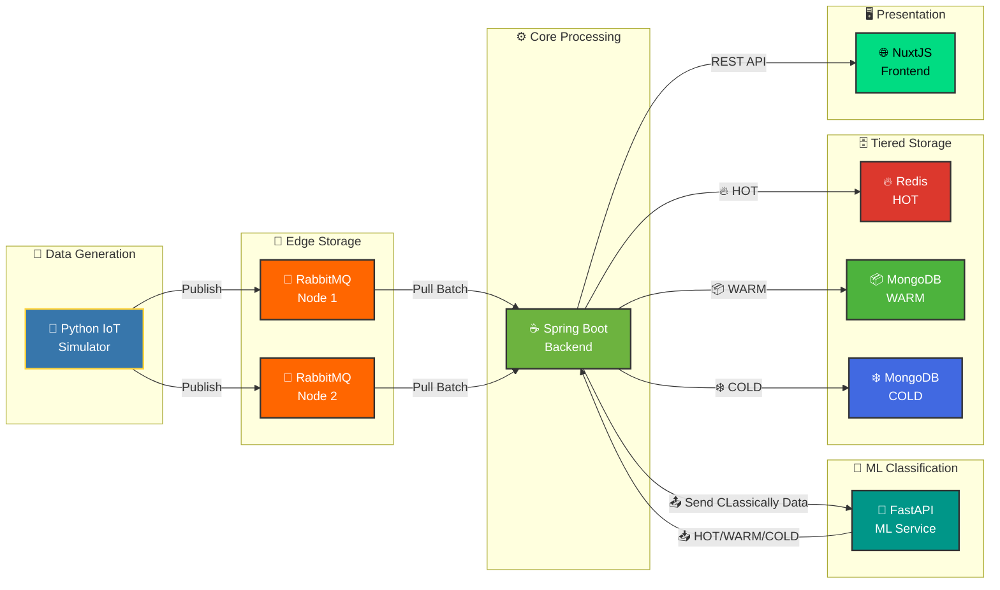

# SmartCity-Platform (Bài dự thi Phần Mềm Nguồn Mở 2025)

🇻🇳 Tiếng Việt | 🇬🇧 [English](./README_EN.md)

**Đội:** Haui-HIT-H2K

**Trường:** Trường Công Nghệ Thông Tin và Truyền Thông (SICT) - Đại Học Công Nghiệp Hà Nội

[](https://Haui-HIT-H2K.github.io/SmartCity-Platform/)
[](./LICENSE)

Bài dự thi Nền tảng Dữ liệu Đô thị Thông minh với Kiến trúc Lưu trữ Biên Phân tán và Phân lớp Dữ liệu Thông minh.

## 💡 Ý tưởng Cốt lõi

Dự án này xây dựng một **Nền tảng Dữ liệu Đô thị Thông minh** (Smart Urban Data Platform) với kiến trúc phân tầng lưu trữ (Tiered Storage Architecture), tự động phân loại và định tuyến dữ liệu IoT theo mức độ quan trọng.

### Đặc điểm Chính

1. **ML-Driven Data Classification:** Sử dụng Machine Learning (IsolationForest) để tự động phân loại dữ liệu cảm biến thành 3 mức:
   - **HOT** - Dữ liệu bất thường/khẩn cấp cần xử lý ngay
   - **WARM** - Dữ liệu quan trọng cần lưu trữ lâu dài  
   - **COLD** - Dữ liệu thông thường cho mục đích lưu trữ

2. **Pull-based Architecture:** Backend chủ động PULL dữ liệu từ Edge Storage (RabbitMQ), đảm bảo:
   - Không quá tải hệ thống lõi khi có data spike
   - Xử lý batch hiệu quả (5000 messages/lần)
   - Resilient - tiếp tục hoạt động khi một edge node fail

3. **Tiered Storage Strategy:**
   - HOT data → **Redis** (In-memory, TTL 1 giờ) cho truy xuất real-time
   - WARM/COLD data → **MongoDB** (Persistent storage) cho phân tích lịch sử

## 🏗️ Kiến trúc Hệ thống



### Luồng Dữ liệu Chi tiết

1. **Data Generation:** Python simulator tạo dữ liệu cảm biến (temperature, humidity, CO2)
2. **Edge Buffering:** Dữ liệu được push vào RabbitMQ (2 edge nodes để high availability)
3. **Backend Ingestion:** Spring Boot backend pull dữ liệu theo batch (mỗi 10 giây)
4. **ML Classification:** Mỗi record được gửi đến ML Service để phân loại
5. **Tiered Storage:** Dữ liệu được route tới Redis (HOT) hoặc MongoDB (WARM/COLD)
6. **Visualization:** Frontend NuxtJS hiển thị dữ liệu real-time

## 🛠️ Công nghệ & Tech Stack

### Core Services

- **Backend:** Spring Boot 3.2 (Java 17)
  - RabbitMQ Integration (Message Pull)
  - Redis Integration (Hot Storage)
  - MongoDB Multi-Datasource (Warm/Cold Storage)
  - REST API cho Frontend
  
- **ML Service:** FastAPI (Python)
  - scikit-learn IsolationForest models
  - 3 trained models: temperature, humidity, CO2
  - REST endpoint `/predict` cho classification
  
- **Frontend:** NuxtJS 3 (Vue.js)
  - Real-time dashboard
  - Data explorer với pagination
  - Responsive design

### Infrastructure (Open Source)

- **Message Queue:** RabbitMQ 3 (Edge Storage Layer)
- **In-Memory Cache:** Redis Alpine (HOT tier)
- **Database:** MongoDB 7.0 (WARM/COLD tiers)
- **Container Orchestration:** Docker & Docker Compose
- **Data Generator:** Python 3.10 với Faker

## 🚀 Hướng dẫn Cài đặt & Chạy

### Yêu cầu Hệ thống

- Docker Desktop đã cài đặt và đang chạy
- Git
- 8GB RAM khả dụng
- Ports: 3000, 5672-5673, 6379, 8000, 8080, 8081, 15672-15673, 27018-27019

### Bước 1: Clone Repository

```bash
git clone https://github.com/Haui-HIT-H2K/SmartCity-Platform.git
cd SmartCity-Platform
```

### Bước 2: Khởi động Hệ thống

```bash
# Build và start tất cả services
docker-compose up -d --build
```

Lệnh này sẽ khởi động:
- 2x RabbitMQ nodes (Edge Storage)
- Redis (HOT storage)
- 2x MongoDB instances (WARM/COLD)
- Mongo Express (Database UI)
- Spring Boot Backend
- ML Service (FastAPI)
- NuxtJS Frontend

**Lưu ý:** Lần build đầu tiên có thể mất 5-10 phút.

### Bước 3: ML Service tự động train models (Không cần thao tác tay)

Từ thời điểm này, **không cần train/copy models thủ công nữa**. Container `smart-city-ml` đã dùng `entrypoint.sh` để:

- Kiểm tra sự tồn tại của các file model trong `ml-service/app/models/*.pkl`
- Nếu **chưa có**, tự động gọi `python3 /app/train_models.py` bên trong container
- Sau đó mới khởi động FastAPI bằng Uvicorn

Vì vậy, sau khi chạy `docker-compose up -d --build`, bạn chỉ cần:

```bash
# Xem logs ML service để theo dõi quá trình auto-train
docker logs -f smart-city-ml

# Kiểm tra health xem models đã load chưa
curl http://localhost:8000/health
```

> Nếu bạn muốn train lại models để thay đổi thuật toán/dữ liệu, xem thêm phần hướng dẫn trong `ml-service/README.md`.

### Bước 4: Khởi động Data Simulator

```bash
# Terminal mới
cd python-data-simulator
pip install -r requirements.txt
python main.py
```

Simulator sẽ gửi 40 triệu IoT messages vào hệ thống.

### Bước 5: Kiểm tra Hệ thống

```bash
# Kiểm tra tất cả containers đang chạy
docker ps

# Xem logs backend
docker logs smart-city-backend --tail 50

# Kiểm tra ML service
curl http://localhost:8000/health
```

## 🌐 Truy cập Giao diện

| Service | URL | Mô tả |
|---------|-----|-------|
| **Frontend Dashboard** | http://localhost:3000 | Giao diện chính hiển thị dữ liệu |
| **Data Explorer** | http://localhost:3000/data-explorer | Khám phá dữ liệu với phân trang |
| **Backend API** | http://localhost:8080 | RESTful API endpoints |
| **ML Service** | http://localhost:8000/docs | FastAPI Swagger docs |
| **RabbitMQ Management** | http://localhost:15672 | user: `edge_user`, pass: `edge_pass` |
| **Mongo Express** | http://localhost:8081 | MongoDB admin UI |

## 📊 Kiến trúc ML Classification

### IsolationForest Models

Hệ thống sử dụng 3 trained IsolationForest models:

1. **Temperature Model** (1.5 MB)
   - Training range: 15-35°C (normal urban)
   - Detects: Extreme heat/cold anomalies
   
2. **Humidity Model** (1.59 MB)
   - Training range: 30-80% (normal range)
   - Detects: Unusual humidity spikes
   
3. **CO2 Model** (1.9 MB)
   - Training range: 350-900 ppm
   - Detects: Dangerous CO2 levels

### Data Distribution (Typical)

- **35% HOT** - Anomalies requiring immediate attention
- **65% COLD** - Normal sensor readings
- **0% WARM** - Reserved for future use (can be configured)

## 🎯 Performance Metrics

- **Throughput:** ~500 messages/second
- **Batch Size:** 5,000 messages per pull
- **Pull Interval:** 10 seconds
- **ML Latency:** <50ms per classification
- **Storage TTL (HOT):** 3600 seconds (1 hour)

## 📁 Cấu trúc Dự án

```
SmartCity-Platform/
├── backend/                 # Spring Boot backend
│   ├── src/main/java/
│   │   └── com/smartcity/
│   │       ├── config/     # Configuration classes
│   │       ├── controller/ # REST API controllers
│   │       ├── model/      # Data models
│   │       └── service/    # Business logic
│   └── Dockerfile
├── ml-service/             # FastAPI ML service
│   ├── app/
│   │   ├── models/         # Trained .pkl models
│   │   └── main.py         # FastAPI app
│   ├── train_models.py     # Model training script
│   └── Dockerfile
├── frontend/               # NuxtJS frontend
│   ├── pages/
│   ├── components/
│   └── Dockerfile
├── python-data-simulator/  # IoT data simulator
│   ├── main.py
│   └── config.py
├── docker-compose.yml      # Service orchestration
└── README.md
```

## 🔧 Configuration

### Backend Application (application.yml)

```yaml
spring:
  profiles:
    active: docker  # Important: use 'docker' profile for container deployment

ml:
  service:
    url: http://smart-city-ml:8000  # ML service URL

ingestion:
  batch:
    size: 1000          # Messages per batch
    max-size: 5000      # Max batch size
  schedule:
    fixed-rate: 10000   # Pull every 10 seconds
```

### Data Simulator (config.py)

```python
TOTAL_REQUESTS = 40_000_000  # 40 million messages
NUM_THREADS = 20              # Concurrent threads
NUM_SENSORS = 1000            # Simulated sensors
```

## 🧪 Testing & Verification

### Verify ML Service

```bash
curl -X POST http://localhost:8000/predict \
  -H "Content-Type: application/json" \
  -d '{"source":"sensor","metric_type":"temperature","value":45.5}'
```

Expected response:
```json
{
  "label": "HOT",
  "uri": "https://schema.org/Warning",
  "desc": "Temperature Anomaly Detected"
}
```

### Verify Data in Storage

```bash
# Check Redis (HOT data)
docker exec core-redis-hot redis-cli DBSIZE

# Check MongoDB (COLD data)
docker exec core-mongo-cold mongosh -u admin -p password123 \
  --eval "db.getSiblingDB('cold_db').city_data.countDocuments()"
```

### Monitor Backend Logs

```bash
docker logs smart-city-backend --tail 100 -f
```

Look for:
- `Data classification completed: HOT=X, WARM=Y, COLD=Z`
- `Successfully stored X HOT records to Redis`
- `Successfully bulk inserted X COLD records`

## 🛑 Dừng Hệ thống

```bash
# Dừng tất cả services
docker-compose down

# Dừng và xóa volumes (reset data)
docker-compose down -v
```

## 🐛 Troubleshooting

### ML Service không load models

```bash
# 1. Kiểm tra models trong container
docker exec smart-city-ml ls -lh /app/app/models/

# 2. Nếu thư mục trống, rebuild lại ml-service
docker-compose build --no-cache ml-service
docker-compose up -d ml-service

# entrypoint.sh sẽ tự động train lại models khi container khởi động
```

### Backend không kết nối được ML Service

Kiểm tra `application.yml` đảm bảo:
- Profile = `docker` (không phải `local`)
- ML service URL = `http://smart-city-ml:8000`

### Frontend không hiển thị data

Kiểm tra backend API:
```bash
curl http://localhost:8080/api/data
```

### MongoDB restart liên tục (Database Corruption)

**Triệu chứng:**
- Containers `core-mongo-warm` hoặc `core-mongo-cold` restart liên tục
- Logs hiển thị lỗi: `WT_TRY_SALVAGE: database corruption detected` hoặc `WT_PANIC: WiredTiger library panic`
- Lỗi: `Detected unclean shutdown - Lock file is not empty`

**Nguyên nhân:**
- Container bị dừng đột ngột (unclean shutdown)
- Database files bị corrupt do WiredTiger không đọc được metadata
- Lock files không được clear đúng cách

**Giải pháp:**

**Cách 1: Sử dụng script tự động (Khuyến nghị)**
```powershell
# Chạy script fix corruption
.\fix-mongodb-corruption.ps1
```

**Cách 2: Thủ công**
```powershell
# 1. Dừng MongoDB containers
docker-compose stop core-mongo-warm core-mongo-cold

# 2. Xóa data directories bị corrupt
Remove-Item -Recurse -Force ./data/warm
Remove-Item -Recurse -Force ./data/cold

# 3. Tạo lại thư mục sạch
New-Item -ItemType Directory -Force -Path ./data/warm
New-Item -ItemType Directory -Force -Path ./data/cold

# 4. Khởi động lại containers
docker-compose up -d core-mongo-warm core-mongo-cold

# 5. Kiểm tra logs
docker logs core-mongo-warm --follow
docker logs core-mongo-cold --follow
```

**Lưu ý:**
- ⚠️ **Cảnh báo:** Xóa data directories sẽ mất toàn bộ dữ liệu hiện tại
- Backup dữ liệu trước khi xóa nếu có dữ liệu quan trọng
- Sau khi xóa, MongoDB sẽ tự động khởi tạo database mới khi container start

**Phòng tránh:**
- Luôn dừng containers đúng cách: `docker-compose down` (không dùng kill/force stop)
- Tránh tắt máy đột ngột khi containers đang chạy
- Thư mục `data/` đã được thêm vào `.gitignore` để tránh commit database files lên Git

## 📚 Tài liệu Chi tiết

Tài liệu đầy đủ về API, kiến trúc, và hướng dẫn phát triển:

➡️ **https://Haui-HIT-H2K.github.io/SmartCity-Platform/**

## 🤝 Đóng góp cho Dự án

* **Báo lỗi ⚠️:** [Tạo Bug Report](https://github.com/Haui-HIT-H2K/SmartCity-Platform/issues/new?template=bao-loi.md)
* **Đề xuất tính năng:** [Feature Request](https://github.com/Haui-HIT-H2K/SmartCity-Platform/issues/new?template=de-xuat-tinh-nang.md)

Mọi đóng góp đều được trân trọng. Vui lòng đọc **Quy định:** [CONTRIBUTING](https://github.com/Haui-HIT-H2K/SmartCity-Platform/blob/main/.github/ISSUE_TEMPLATE.md) trước khi gửi pull request.

---

## 📞 Liên hệ

* **Nguyễn Huy Hoàng:** nguyenhuyhoangpt0402@gmail.com
* **Trần Danh Khang:** trandanhkhang482004@gmail.com
* **Nguyễn Huy Hoàng:** nguyenhuyhoangqbx5@gmail.com

---

## ⚖️ Giấy phép

Dự án này được cấp phép theo **Apache License 2.0**. Xem chi tiết tại [LICENSE](./LICENSE).

---

## 🏆 Thành tựu

- ✅ Machine Learning Integration cho classification tự động
- ✅ Tiered Storage Architecture với Redis + MongoDB
- ✅ Pull-based Resilient Architecture
- ✅ Scalable to 40M+ messages
- ✅ Real-time Dashboard với NuxtJS
- ✅ 100% Containerized với Docker
- ✅ Production-ready với error handling & logging
