# SmartCity-Platform (Open Source Software Competition 2025)

🇻🇳 [Tiếng Việt](./README.md) | 🇬🇧 English

**Team:** Haui-HIT-H2K

**University:** School of Information and Communication Technology (SICT) - Hanoi University of Industry

[](https://Haui-HIT-H2K.github.io/SmartCity-Platform/)
[](./LICENSE)

Smart Urban Data Platform with Distributed Edge Storage Architecture and Intelligent Tiered Data Storage.

## Introduction about SmartCity-Platform

SmartCity-Platform is an innovative **Smart Urban Data Platform** designed to efficiently manage and process IoT sensor data in smart city environments. Built with a modern microservices architecture, the platform features intelligent data classification using Machine Learning and a tiered storage strategy for optimal performance.

With its modular design and containerized deployment, SmartCity-Platform is cross-platform and framework independent. By basic knowledge of Java, Python, and Vue.js, you can easily extend the platform for your purposes.

The platform's core is simply but powerful. It supports automatic data classification into HOT, WARM, and COLD categories based on anomaly detection, enabling real-time alerting for critical events while efficiently storing historical data for analysis.

SmartCity-Platform supports automatic data routing based on ML predictions, real-time monitoring dashboards, and comprehensive API documentation for integration with external systems.

## 💡 Core Concept

This project builds a **Smart Urban Data Platform** with Tiered Storage Architecture that automatically classifies and routes IoT data based on importance level.

### Key Features

1. **ML-Driven Data Classification:** Uses Machine Learning (IsolationForest) to automatically classify sensor data into 3 levels:

   - **HOT** - Abnormal/urgent data requiring immediate processing
   - **WARM** - Important data needing long-term storage
   - **COLD** - Normal data for archival purposes

2. **Pull-based Architecture:** Backend actively PULLS data from Edge Storage (RabbitMQ), ensuring:

   - No system overload during data spikes
   - Efficient batch processing (5000 messages/batch)
   - Resilient - continues operating when edge nodes fail

3. **Tiered Storage Strategy:**
   - HOT data → **Redis** (In-memory, TTL 1 hour) for real-time access
   - WARM/COLD data → **MongoDB** (Persistent storage) for historical analysis

## 🏗️ System Architecture

```mermaid
graph LR
    subgraph DataGen["📡 Data Generation"]
        A["🐍 Python IoT<br/>Simulator"]
    end

    subgraph EdgeStorage["💾 Edge Storage"]
        B["🐰 RabbitMQ<br/>Node 1"]
        L["🐰 RabbitMQ<br/>Node 2"]
    end

    subgraph CoreProcessing["⚙️ Core Processing"]
        C["☕ Spring Boot<br/>Backend"]
    end

    subgraph MLLayer["🤖 ML Classification"]
        D["🧠 FastAPI<br/>ML Service"]
    end

    subgraph TieredStorage["🗄️ Tiered Storage"]
        E["🔥 Redis<br/>HOT"]
        K["📦 MongoDB<br/>WARM"]
        F["❄️ MongoDB<br/>COLD"]
    end

    subgraph Presentation["🖥️ Presentation"]
        G["🌐 NuxtJS<br/>Frontend"]
    end

    %% Data Flow: Generation → Edge
    A -->|"Publish"| B
    A -->|"Publish"| L

    %% Data Flow: Edge → Backend
    B -->|"Pull Batch"| C
    L -->|"Pull Batch"| C

    %% ML Classification Flow (2 separate arrows)
    C -->|"📤 Send CLassically Data"| D
    D -->|"📥 HOT/WARM/COLD"| C

    %% Tiered Storage Routing
    C -->|"🔥 HOT"| E
    C -->|"📦 WARM"| K
    C -->|"❄️ COLD"| F

    %% API Layer
    C -->|"REST API"| G


    %% Styling
    style A fill:#3776AB,stroke:#FFD43B,stroke-width:2px,color:#fff
    style B fill:#FF6600,stroke:#333,stroke-width:2px,color:#fff
    style L fill:#FF6600,stroke:#333,stroke-width:2px,color:#fff
    style C fill:#6DB33F,stroke:#333,stroke-width:2px,color:#fff
    style D fill:#009688,stroke:#333,stroke-width:2px,color:#fff
    style E fill:#DC382D,stroke:#333,stroke-width:2px,color:#fff
    style K fill:#4DB33D,stroke:#333,stroke-width:2px,color:#fff
    style F fill:#4169E1,stroke:#333,stroke-width:2px,color:#fff
    style G fill:#00DC82,stroke:#333,stroke-width:2px,color:#000
```



### Detailed Data Flow

1. **Data Generation:** Python simulator creates sensor data (temperature, humidity, CO2)
2. **Edge Buffering:** Data is pushed to RabbitMQ (2 edge nodes for high availability)
3. **Backend Ingestion:** Spring Boot backend pulls data in batches (every 10 seconds)
4. **ML Classification:** Each record is sent to ML Service for classification
5. **Tiered Storage:** Data is routed to Redis (HOT) or MongoDB (WARM/COLD)
6. **Visualization:** NuxtJS frontend displays real-time data

## 🛠️ Technology & Tech Stack

### Core Services

- **Backend:** Spring Boot 3.2 (Java 17)
  - RabbitMQ Integration (Message Pull)
  - Redis Integration (Hot Storage)
  - MongoDB Multi-Datasource (Warm/Cold Storage)
  - REST API for Frontend
- **ML Service:** FastAPI (Python)
  - scikit-learn IsolationForest models
  - 3 trained models: temperature, humidity, CO2
  - REST endpoint `/predict` for classification
- **Frontend:** NuxtJS 3 (Vue.js)
  - Real-time dashboard
  - Data explorer with pagination
  - Responsive design

### Infrastructure (Open Source)

- **Message Queue:** RabbitMQ 3 (Edge Storage Layer)
- **In-Memory Cache:** Redis Alpine (HOT tier)
- **Database:** MongoDB 7.0 (WARM/COLD tiers)
- **Container Orchestration:** Docker & Docker Compose
- **Data Generator:** Python 3.10 with Faker

## 🚀 Installation & Running Guide

### System Requirements

- Docker Desktop installed and running
- Git
- 8GB available RAM
- Ports: 3000, 5672-5673, 6379, 8000, 8080, 8081, 15672-15673, 27018-27019

### Step 1: Clone Repository

```bash
git clone https://github.com/Haui-HIT-H2K/SmartCity-Platform.git
cd SmartCity-Platform
```

### Step 2: Start the System

```bash
# Build and start all services
docker-compose up -d --build
```

This command will start:

- 2x RabbitMQ nodes (Edge Storage)
- Redis (HOT storage)
- 2x MongoDB instances (WARM/COLD)
- Mongo Express (Database UI)
- Spring Boot Backend
- ML Service (FastAPI)
- NuxtJS Frontend

**Note:** First build may take 5-10 minutes.

### Step 3: ML Service Auto-trains Models (No Manual Action Required)

From this point, **no need to manually train/copy models**. The `smart-city-ml` container uses `entrypoint.sh` to:

- Check for model files in `ml-service/app/models/*.pkl`
- If **not found**, automatically call `python3 /app/train_models.py` inside the container
- Then start FastAPI with Uvicorn

After running `docker-compose up -d --build`, you only need to:

```bash
# View ML service logs to monitor auto-train progress
docker logs -f smart-city-ml

# Check health to see if models are loaded
curl http://localhost:8000/health
```

> If you want to retrain models to change algorithms/data, see more instructions in `ml-service/README.md`.

### Step 4: Start Data Simulator

```bash
# New terminal
cd python-data-simulator
pip install -r requirements.txt
python main.py
```

The simulator will send 40 million IoT messages to the system.

### Step 5: Verify the System

```bash
# Check all running containers
docker ps

# View backend logs
docker logs smart-city-backend --tail 50

# Check ML service
curl http://localhost:8000/health
```

## 🌐 Access Interfaces

| Service                 | URL                                 | Description                          |
| ----------------------- | ----------------------------------- | ------------------------------------ |
| **Frontend Dashboard**  | http://localhost:3000               | Main interface displaying data       |
| **Data Explorer**       | http://localhost:3000/data-explorer | Explore data with pagination         |
| **Backend API**         | http://localhost:8080               | RESTful API endpoints                |
| **ML Service**          | http://localhost:8000/docs          | FastAPI Swagger docs                 |
| **RabbitMQ Management** | http://localhost:15672              | user: `edge_user`, pass: `edge_pass` |
| **Mongo Express**       | http://localhost:8081               | MongoDB admin UI                     |

## 📊 ML Classification Architecture

### IsolationForest Models

The system uses 3 trained IsolationForest models:

1. **Temperature Model** (1.5 MB)
   - Training range: 15-35°C (normal urban)
   - Detects: Extreme heat/cold anomalies
2. **Humidity Model** (1.59 MB)
   - Training range: 30-80% (normal range)
   - Detects: Unusual humidity spikes
3. **CO2 Model** (1.9 MB)
   - Training range: 350-900 ppm
   - Detects: Dangerous CO2 levels

### Data Distribution (Typical)

- **35% HOT** - Anomalies requiring immediate attention
- **65% COLD** - Normal sensor readings
- **0% WARM** - Reserved for future use (can be configured)

## 🎯 Performance Metrics

- **Throughput:** ~500 messages/second
- **Batch Size:** 5,000 messages per pull
- **Pull Interval:** 10 seconds
- **ML Latency:** <50ms per classification
- **Storage TTL (HOT):** 3600 seconds (1 hour)

## 📁 Project Structure

```
SmartCity-Platform/
├── backend/                 # Spring Boot backend
│   ├── src/main/java/
│   │   └── com/smartcity/
│   │       ├── config/     # Configuration classes
│   │       ├── controller/ # REST API controllers
│   │       ├── model/      # Data models
│   │       └── service/    # Business logic
│   └── Dockerfile
├── ml-service/             # FastAPI ML service
│   ├── app/
│   │   ├── models/         # Trained .pkl models
│   │   └── main.py         # FastAPI app
│   ├── train_models.py     # Model training script
│   └── Dockerfile
├── frontend/               # NuxtJS frontend
│   ├── pages/
│   ├── components/
│   └── Dockerfile
├── python-data-simulator/  # IoT data simulator
│   ├── main.py
│   └── config.py
├── docker-compose.yml      # Service orchestration
└── README.md
```

## 🔧 Configuration

### Backend Application (application.yml)

```yaml
spring:
  profiles:
    active: docker # Important: use 'docker' profile for container deployment

ml:
  service:
    url: http://smart-city-ml:8000 # ML service URL

ingestion:
  batch:
    size: 1000 # Messages per batch
    max-size: 5000 # Max batch size
  schedule:
    fixed-rate: 10000 # Pull every 10 seconds
```

### Data Simulator (config.py)

```python
TOTAL_REQUESTS = 40_000_000  # 40 million messages
NUM_THREADS = 20              # Concurrent threads
NUM_SENSORS = 1000            # Simulated sensors
```

## 🧪 Testing & Verification

### Verify ML Service

```bash
curl -X POST http://localhost:8000/predict \
  -H "Content-Type: application/json" \
  -d '{"source":"sensor","metric_type":"temperature","value":45.5}'
```

Expected response:

```json
{
  "label": "HOT",
  "uri": "https://schema.org/Warning",
  "desc": "Temperature Anomaly Detected"
}
```

### Verify Data in Storage

```bash
# Check Redis (HOT data)
docker exec core-redis-hot redis-cli DBSIZE

# Check MongoDB (COLD data)
docker exec core-mongo-cold mongosh -u admin -p password123 \
  --eval "db.getSiblingDB('cold_db').city_data.countDocuments()"
```

### Monitor Backend Logs

```bash
docker logs smart-city-backend --tail 100 -f
```

Look for:

- `Data classification completed: HOT=X, WARM=Y, COLD=Z`
- `Successfully stored X HOT records to Redis`
- `Successfully bulk inserted X COLD records`

## 🛑 Stop the System

```bash
# Stop all services
docker-compose down

# Stop and remove volumes (reset data)
docker-compose down -v
```

## 🐛 Troubleshooting

### ML Service not loading models

```bash
# 1. Check models in container
docker exec smart-city-ml ls -lh /app/app/models/

# 2. If directory is empty, rebuild ml-service
docker-compose build --no-cache ml-service
docker-compose up -d ml-service

# entrypoint.sh will automatically retrain models when container starts
```

### Backend cannot connect to ML Service

Check `application.yml` to ensure:

- Profile = `docker` (not `local`)
- ML service URL = `http://smart-city-ml:8000`

### Frontend not displaying data

Check backend API:

```bash
curl http://localhost:8080/api/data
```

### MongoDB restarting continuously (Database Corruption)

**Symptoms:**

- Containers `core-mongo-warm` or `core-mongo-cold` restart continuously
- Logs show errors: `WT_TRY_SALVAGE: database corruption detected` or `WT_PANIC: WiredTiger library panic`
- Error: `Detected unclean shutdown - Lock file is not empty`

**Cause:**

- Container stopped unexpectedly (unclean shutdown)
- Database files corrupted because WiredTiger cannot read metadata
- Lock files not cleared properly

**Solution:**

**Method 1: Use automatic script (Recommended)**

```powershell
# Run corruption fix script
.\fix-mongodb-corruption.ps1
```

**Method 2: Manual**

```powershell
# 1. Stop MongoDB containers
docker-compose stop core-mongo-warm core-mongo-cold

# 2. Delete corrupted data directories
Remove-Item -Recurse -Force ./data/warm
Remove-Item -Recurse -Force ./data/cold

# 3. Create fresh directories
New-Item -ItemType Directory -Force -Path ./data/warm
New-Item -ItemType Directory -Force -Path ./data/cold

# 4. Restart containers
docker-compose up -d core-mongo-warm core-mongo-cold

# 5. Check logs
docker logs core-mongo-warm --follow
docker logs core-mongo-cold --follow
```

**Note:**

- ⚠️ **Warning:** Deleting data directories will erase all current data
- Backup data before deleting if you have important data
- After deletion, MongoDB will automatically initialize a new database when the container starts

**Prevention:**

- Always stop containers properly: `docker-compose down` (don't use kill/force stop)
- Avoid sudden shutdowns while containers are running
- `data/` directory is added to `.gitignore` to avoid committing database files to Git

## Licensing

SmartCity-Platform is released under **Apache License 2.0** or any later version.

See [LICENSE](./LICENSE) for the full license.

## 📚 Detailed Documentation

Complete documentation on API, architecture, and development guides:

➡️ **https://Haui-HIT-H2K.github.io/SmartCity-Platform/**

## 🤝 Contributing to the Project

- **Report bugs ⚠️:** [Create Bug Report](https://github.com/Haui-HIT-H2K/SmartCity-Platform/issues/new?template=bao-loi.md)
- **Feature suggestions:** [Feature Request](https://github.com/Haui-HIT-H2K/SmartCity-Platform/issues/new?template=de-xuat-tinh-nang.md)

All contributions are appreciated. Please read **Guidelines:** [CONTRIBUTING](https://github.com/Haui-HIT-H2K/SmartCity-Platform/blob/main/.github/ISSUE_TEMPLATE.md) before submitting a pull request.

---

## 📞 Contact

- **Nguyen Huy Hoang:** nguyenhuyhoangpt0402@gmail.com
- **Tran Danh Khang:** trandanhkhang482004@gmail.com
- **Nguyen Huy Hoang:** nguyenhuyhoangqbx5@gmail.com

---

## 🏆 Achievements

- ✅ Machine Learning Integration for automatic classification
- ✅ Tiered Storage Architecture with Redis + MongoDB
- ✅ Pull-based Resilient Architecture
- ✅ Scalable to 40M+ messages
- ✅ Real-time Dashboard with NuxtJS
- ✅ 100% Containerized with Docker
- ✅ Production-ready with error handling & logging

---

## Community & Resources

- **GitHub Repository:** https://github.com/Haui-HIT-H2K/SmartCity-Platform
- **Documentation:** https://Haui-HIT-H2K.github.io/SmartCity-Platform/
- **Issues:** https://github.com/Haui-HIT-H2K/SmartCity-Platform/issues

## Development Team

**HAUI-HIT-H2K** - School of Information and Communication Technology (SICT), Hanoi University of Industry

Website: https://github.com/Haui-HIT-H2K
