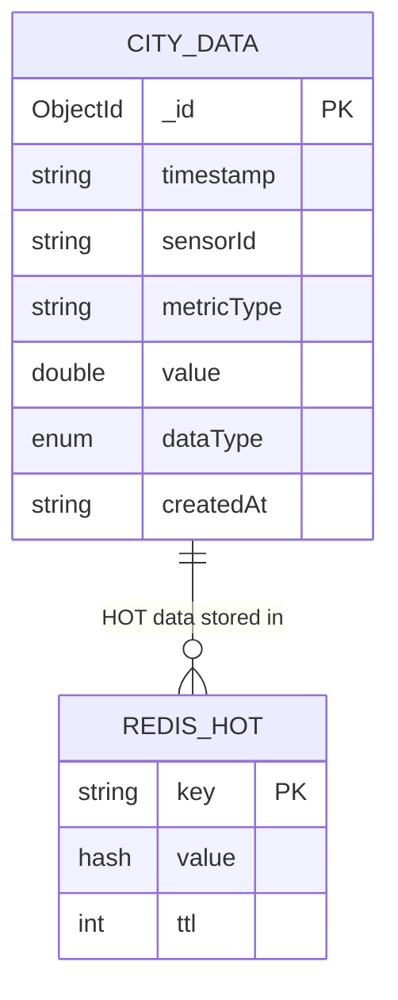

# Data Model

## CityData Entity

Đây là entity chính để lưu trữ dữ liệu IoT trong hệ thống.

### Java Class

```java
@Data
@Document(collection = "city_data")
public class CityData {
    @Id
    private String id;
    
    private String timestamp;
    private String sensorId;
    private String metricType;  // temperature, humidity, co2
    private Double value;
    private DataType dataType;  // HOT, WARM, COLD
    
    @Indexed
    private String createdAt;
}
```

### MongoDB Document

```json
{
  "_id": ObjectId("675fb09c1a2b3c4d5e6f7890"),
  "timestamp": "2025-12-04T22:57:00Z",
  "sensorId": "SENSOR_0042",
  "metricType": "temperature",
  "value": 45.5,
  "dataType": "HOT",
  "createdAt": "2025-12-04T22:57:01Z"
}
```

### Field Descriptions

| Field | Type | Indexed | Description |
|-------|------|---------|-------------|
| `_id` | ObjectId | Primary Key | MongoDB auto-generated ID |
| `timestamp` | String (ISO 8601) | Yes | Thời điểm đo của sensor |
| `sensorId` | String | Yes | ID của sensor (SENSOR_XXXX) |
| `metricType` | String | Yes | Loại metric: temperature, humidity, co2 |
| `value` | Double | No | Giá trị đo được |
| `dataType` | Enum | Yes | Classification: HOT, WARM, COLD |
| `createdAt` | String (ISO 8601) | TTL Index | Thời điểm lưu vào database |

---

## DataType Enum

```java
public enum DataType {
    HOT,    // Anomaly data - stored in Redis + MongoDB
    WARM,   // Important recent data - stored in MongoDB warm_db
    COLD    // Normal data - stored in MongoDB cold_db
}
```

---

## Redis Data Structure (HOT Tier)

### Key Pattern
```
hot:sensor:{sensorId}:{timestamp}
```

### Example
```redis
Key: hot:sensor:SENSOR_0042:2025-12-04T22:57:00Z

Value (Hash):
  sensorId: "SENSOR_0042"
  metricType: "temperature"
  value: "45.5"
  timestamp: "2025-12-04T22:57:00Z"
  dataType: "HOT"

TTL: 3600 seconds (1 hour)
```

### Redis Commands
```bash
# Get single HOT record
HGETALL hot:sensor:SENSOR_0042:2025-12-04T22:57:00Z

# Get all HOT keys
KEYS hot:sensor:*

# Count HOT records
DBSIZE

# Check TTL
TTL hot:sensor:SENSOR_0042:2025-12-04T22:57:00Z
```

---

## MongoDB Collections

### WARM Tier (warm_db.city_data)

**Collection:** `city_data`  
**Database:** `warm_db`

**Indexes:**
```javascript
db.city_data.createIndex({ "timestamp": 1 })
db.city_data.createIndex({ "sensorId": 1 })
db.city_data.createIndex({ "metricType": 1 })
db.city_data.createIndex({ "dataType": 1 })
db.city_data.createIndex({ "createdAt": 1 }, { expireAfterSeconds: 2592000 }) // 30 days
```

**Document Count:**
```javascript
db.getSiblingDB('warm_db').city_data.countDocuments()
```

### COLD Tier (cold_db.city_data)

**Collection:** `city_data`  
**Database:** `cold_db`

**Indexes:** Same as WARM tier (except no TTL index)

**Document Count:**
```javascript
db.getSiblingDB('cold_db').city_data.countDocuments()
```

---

## EdgeNodeConfig Model

```java
@Data
public class EdgeNodeConfig {
    private String host;
    private int port;
    private String username;
    private String password;
    private String status;  // online, offline
    private String lastPing;
}
```

---

## SystemStats DTO

```java
@Data
public class SystemStatsDTO {
    private long hotCount;
    private long warmCount;
    private long coldCount;
    private double incomingRate;
    private double processedRate;
    private String lastUpdate;
}
```

---

## ML Prediction Request

```json
{
  "source": "SENSOR_0042",
  "metric_type": "temperature",
  "value": 45.5
}
```

## ML Prediction Response

```json
{
  "label": "HOT",
  "uri": "https://schema.org/Warning",
  "desc": "Temperature Anomaly Detected"
}
```

---

## Database Schema Diagram


