Đây là luồng dữ liệu (data flow) End-to-End của hệ thống SmartCity-Platform, kết hợp giữa ý tưởng **DNS Routing & PULL Model** (Tiêu chí 7) và yêu cầu **NGSI-LD** (Tiêu chí Kỹ thuật).

---

## 1. Sơ đồ Kiến trúc Tổng thể

```mermaid
graph LR
    subgraph DataGen["📡 Data Generation"]
        A["🐍 Python IoT<br/>Simulator"]
    end

    subgraph EdgeStorage["💾 Edge Storage"]
        B["🐰 RabbitMQ<br/>Node 1"]
        L["🐰 RabbitMQ<br/>Node 2"]
    end

    subgraph CoreProcessing["⚙️ Core Processing"]
        C["☕ Spring Boot<br/>Backend"]
    end

    subgraph MLLayer["🤖 ML Classification"]
        D["🧠 FastAPI<br/>ML Service"]
    end

    subgraph TieredStorage["🗄️ Tiered Storage"]
        E["🔥 Redis<br/>HOT"]
        K["📦 MongoDB<br/>WARM"]
        F["❄️ MongoDB<br/>COLD"]
    end

    subgraph Presentation["🖥️ Presentation"]
        G["🌐 NuxtJS<br/>Frontend"]
    end

    %% Data Flow: Generation → Edge
    A -->|"Publish"| B
    A -->|"Publish"| L

    %% Data Flow: Edge → Backend
    B -->|"Pull Batch"| C
    L -->|"Pull Batch"| C

    %% ML Classification Flow (2 separate arrows)
    C -->|"📤 Send CLassically Data"| D
    D -->|"📥 HOT/WARM/COLD"| C

    %% Tiered Storage Routing
    C -->|"🔥 HOT"| E
    C -->|"📦 WARM"| K
    C -->|"❄️ COLD"| F

    %% API Layer
    C -->|"REST API"| G


    %% Styling
    style A fill:#3776AB,stroke:#FFD43B,stroke-width:2px,color:#fff
    style B fill:#FF6600,stroke:#333,stroke-width:2px,color:#fff
    style L fill:#FF6600,stroke:#333,stroke-width:2px,color:#fff
    style C fill:#6DB33F,stroke:#333,stroke-width:2px,color:#fff
    style D fill:#009688,stroke:#333,stroke-width:2px,color:#fff
    style E fill:#DC382D,stroke:#333,stroke-width:2px,color:#fff
    style K fill:#4DB33D,stroke:#333,stroke-width:2px,color:#fff
    style F fill:#4169E1,stroke:#333,stroke-width:2px,color:#fff
    style G fill:#00DC82,stroke:#333,stroke-width:2px,color:#000
```

---

## 2. Giải thích Luồng Dữ liệu

**Luồng 1 & 2: PUSH & Phân loại (Routing)**  
**A (Nguồn Dữ liệu):** Các thiết bị (Sensor, Camera, User App) gửi dữ liệu thô (raw data) đến một endpoint duy nhất.

**B (DNS Routing):** Dịch vụ DNS Routing (hoặc một API Gateway) "đọc" loại dữ liệu (ví dụ: qua URL hoặc header) và phân loại nó ngay lập tức.

**Dữ liệu PUSH được điều hướng vào 3 kho đệm riêng biệt:**
- Cảnh báo khẩn cấp vào **C1 (Edge Nóng)**.
- Dữ liệu cập nhật thường xuyên vào **C2 (Edge Ấm)**.
- Dữ liệu log/thống kê vào **C3 (Edge Lạnh)**.

**Luồng 3: PULL Ưu tiên (Ý tưởng Cốt lõi)**  
**F (Smart Agent):** Đây là "bộ não" (backend do đội phát triển). Nó chủ động PULL dữ liệu từ 3 kho đệm với thứ tự ưu tiên nghiêm ngặt:
- **Ưu tiên 1:** Luôn PULL và xử lý **C1 (Nóng)** trước.
- **Ưu tiên 2:** Chỉ PULL **C2 (Ấm)** khi C1 rỗng.
- **Ưu tiên 3:** Chỉ PULL **C3 (Lạnh)** khi C1 và C2 đều rỗng.

Đây chính là cơ chế chống quá tải và đảm bảo HA cho hệ thống.

**Luồng 4: Xử lý NGSI-LD (Đáp ứng Đề bài)**  
**F (Smart Agent)** sau khi PULL dữ liệu Nóng/Ấm, sẽ tiến hành chuẩn hóa chúng sang định dạng **NGSI-LD** (sử dụng **FIWARE Data Models**).

F **PUSH** dữ liệu đã chuẩn hóa vào **G (Orion-LD Broker)**. Đây chính là **Lớp Nóng (In-Memory)**, chứa trạng thái hiện tại của thành phố.

**H (Lớp Ấm)** (sử dụng QuantumLeap) tự động "đăng ký" (subscribe) với G. Ngay khi G có dữ liệu mới, nó sẽ tự động sao chép sang **H (TimescaleDB)** để lưu trữ lịch sử.

**Luồng 5: Xử lý Dữ liệu Lạnh**  
Khi F (Smart Agent) PULL dữ liệu từ **E (Lạnh)**, nó sẽ **PUSH** thẳng dữ liệu này vào **I (MinIO)** để lưu trữ dài hạn với chi phí rẻ.

**Luồng 6: Ứng dụng (Demo)**  
**J (Ứng dụng GreenX)** khi cần dữ liệu thời gian thực (ví dụ: "AQI bây giờ?") sẽ truy vấn trực tiếp **G (Lớp Nóng)**.

Khi cần dữ liệu lịch sử (ví dụ: "biểu đồ 7 ngày qua?") sẽ truy vấn **H (Lớp Ấm)**.
