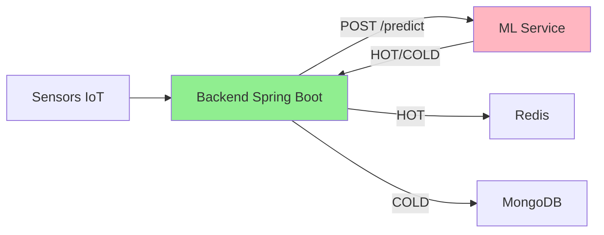

# ML/AI Service - Smart City Platform

## 1. Tổng Quan

ML Service là dịch vụ **Machine Learning** được xây dựng bằng **FastAPI** (Python), chịu trách nhiệm **phân loại tự động dữ liệu IoT** thành các mức độ quan trọng (HOT/COLD) bằng thuật toán **IsolationForest**.

### Vai trò trong hệ thống



### Data Flow Chi Tiết

```
                              ML-SERVICE
                         ┌────────────────────────────────────────┐
                         │                                        │
   Sensor Data           │    ┌─────────────┐                     │
       ↓                 │    │ Prediction  │                     │
  ┌─────────┐            │    │             │                     │
  │ Backend │ ──────────►│    │ confidence? │                     │
  │ (Java)  │   POST     │    └──────┬──────┘                     │
  └────┬────┘  /predict  │           │                            │
       │                 │     ┌─────┴─────┐                      │
       │                 │     │           │                      │
       │                 │   >0.8       ≤0.8                      │
       │                 │     │           │                      │
       │                 │     ▼           ▼                      │
       │                 │  ┌──────┐   ┌──────────┐               │
       │                 │  │Return│   │ Return   │               │
       │                 │  │HOT/  │   │ HOT/COLD │               │
       │                 │  │COLD  │   │    +     │               │
       │                 │  └──┬───┘   │ Log to   │               │
       │                 │     │       │ SQLite   │◄─── UNKNOWN   │
       │                 │     │       └────┬─────┘    lưu ở đây! │
       │                 │     │            │                     │
       │                 └─────┼────────────┼─────────────────────┘
       │                       │            │
       ◄───────────────────────┘            │
       │                                    │
       │ HOT/COLD only                      │
       │ (Backend không biết UNKNOWN)       │
       ▼                                    ▼
  ┌─────────┐                         ┌──────────┐
  │  Redis  │ ← HOT                   │  SQLite  │ ← UNKNOWN
  │ MongoDB │ ← COLD                  │ (in ML)  │   events
  └─────────┘                         └──────────┘
```

**Giải thích:**
- **confidence > 0.8**: Model tin tưởng → trả về HOT/COLD trực tiếp
- **confidence ≤ 0.8**: Model không chắc chắn → vẫn trả HOT/COLD nhưng log vào SQLite để review
- **Backend**: Chỉ nhận HOT/COLD, không biết về UNKNOWN (backward compatible)
- **SQLite**: Lưu trữ các events cần operator review

---

## 2. Công Nghệ Sử Dụng

| Công nghệ | Phiên bản | Vai trò |
|-----------|-----------|---------|
| **FastAPI** | 0.104+ | Web framework (async, high performance) |
| **scikit-learn** | 1.3+ | Machine Learning library |
| **IsolationForest** | - | Anomaly detection algorithm |
| **Python** | 3.10 | Runtime |
| **Uvicorn** | - | ASGI server |
| **Joblib** | - | Model serialization |

### Tại sao chọn FastAPI?

- ✅ **Async native** - Xử lý đồng thời nhiều request
- ✅ **Auto validation** với Pydantic schemas
- ✅ **Auto docs** tại `/docs` (Swagger UI)
- ✅ **High performance** - Ngang với NodeJS, Go

### Tại sao chọn IsolationForest?

- ✅ **Unsupervised** - Không cần labeled data
- ✅ **Fast inference** - ~10-15ms per prediction
- ✅ **Robust** - Hoạt động tốt với sensor data
- ✅ **Simple** - Dễ deploy và maintain

---

## 3. Kiến Trúc Source Code

```
ml-service/
├── app/
│   ├── __init__.py
│   ├── main.py              # FastAPI application entry point
│   ├── config.py            # Configuration & semantic mapping
│   └── models/
│       ├── loader.py        # Model loading utilities
│       ├── schemas.py       # Pydantic request/response schemas
│       ├── temperature_model.pkl
│       ├── humidity_model.pkl
│       └── co2_model.pkl
├── train_models.py          # Training script
├── requirements.txt
├── Dockerfile
└── entrypoint.sh            # Auto-train on startup
```

### Mô tả các file chính

| File | Chức năng |
|------|-----------|
| `main.py` | FastAPI app, endpoints `/predict`, `/health` |
| `config.py` | Paths, semantic map cho camera events |
| `loader.py` | Load models từ `.pkl` files |
| `schemas.py` | Pydantic schemas cho request/response |
| `train_models.py` | Script huấn luyện IsolationForest |

---

## 4. API Endpoints

### 4.1 POST /predict

Phân loại dữ liệu sensor hoặc camera event.

**Request - Sensor:**
```json
{
  "source": "sensor",
  "metric_type": "temperature",
  "value": 45.5
}
```

**Response:**
```json
{
  "label": "HOT",
  "uri": "https://schema.org/Warning",
  "desc": "Temperature Anomaly Detected",
  "metric_type": "temperature",
  "value": 45.5
}
```

**Request - Camera:**
```json
{
  "source": "camera",
  "event": "fire"
}
```

**Response:**
```json
{
  "label": "HOT",
  "uri": "https://schema.org/FireEvent",
  "desc": "Fire Hazard Detected"
}
```

### 4.2 GET /health

Health check endpoint.

**Response:**
```json
{
  "status": "ok",
  "models_loaded": {
    "temperature": true,
    "humidity": true,
    "co2": true
  },
  "total_models": 3
}
```

### 4.3 GET /

Root endpoint.

**Response:**
```json
{
  "service": "ML Anomaly Detection",
  "version": "1.0.0",
  "status": "running",
  "docs": "/docs"
}
```

---

## 5. Thuật Toán IsolationForest

### 5.1 Nguyên lý hoạt động

IsolationForest phát hiện anomaly bằng cách **cô lập** các điểm dữ liệu:

> **Core Idea:** Điểm bất thường dễ bị cô lập hơn điểm bình thường

```
Dữ liệu bình thường          Dữ liệu bất thường
(dense cluster)              (isolated)

     o o o                        
    o O O o  ← Cần nhiều          x  ← Chỉ 1-2 splits
     o o o     splits                 là isolate được!
```

### 5.2 Quy trình

1. **Build Random Forest** - Tạo 100 random decision trees
2. **Random Splits** - Mỗi tree split ngẫu nhiên theo feature và value
3. **Path Length** - Đo độ sâu cần thiết để isolate mỗi điểm
4. **Anomaly Score** - Điểm càng nông = càng bất thường

### 5.3 Công thức

```
Anomaly Score: s(x, n) = 2^(-E(h(x)) / c(n))

Trong đó:
- E(h(x)): Path length trung bình
- c(n): Normalization factor
- s < 0.5: Normal (inlier)
- s > 0.5: Anomaly (outlier)
```

### 5.4 Trong code

```python
# IsolationForest returns: 1 = Normal, -1 = Anomaly
prediction = model.predict([[value]])

if prediction[0] == 1:
    label = "COLD"   # Normal
else:
    label = "HOT"    # Anomaly
```

---

## 6. Training Data

### 6.1 Temperature Model
- **Range:** 15-35°C (normal urban temperature)
- **Samples:** 10,000 (uniform + seasonal patterns)
- **Contamination:** 0.1 (10% anomalies expected)

### 6.2 Humidity Model
- **Range:** 30-80% 
- **Samples:** 10,000
- **Contamination:** 0.1

### 6.3 CO2 Model
- **Range:** 350-900 ppm (safe levels)
- **Samples:** 7,000 (outdoor + indoor)
- **Contamination:** 0.1

---

## 7. Semantic Mapping (Camera Events)

Camera events được map trực tiếp theo bảng:

| Event | Label | URI | Description |
|-------|-------|-----|-------------|
| `fire` | HOT | schema.org/FireEvent | Fire Hazard Detected |
| `accident` | HOT | schema.org/TrafficIncident | Traffic Accident |
| `traffic_jam` | WARM | w3id.org/sosa/Observation | Traffic Congestion |
| `normal` | COLD | schema.org/SafeCondition | Normal Conditions |
| *unknown* | UNKNOWN | schema.org/Thing | Unknown Event |

---

## 8. Performance

### 8.1 Latency

| Metric | Value |
|--------|-------|
| Average | ~15ms |
| p95 | ~30ms |
| p99 | ~50ms |

### 8.2 Resource Usage

| Resource | Usage |
|----------|-------|
| Memory | ~150-200MB |
| CPU | <10% at 20 req/s |
| Startup | ~2-3 seconds |

---

## 9. Deployment

### Docker (Recommended)

```bash
# Build
docker build -t smart-city-ml ./ml-service

# Run
docker run -p 8000:8000 smart-city-ml
```

### Docker Compose

```bash
docker compose up -d ml-service
```

### Manual (Development)

```bash
cd ml-service
pip install -r requirements.txt

# Train models (if not exist)
python train_models.py

# Start server
uvicorn app.main:app --host 0.0.0.0 --port 8000 --reload
```

---

## 10. Demo Commands

```bash
# Health check
curl http://localhost:8000/health

# Predict normal temperature
curl -X POST http://localhost:8000/predict \
  -H "Content-Type: application/json" \
  -d '{"source":"sensor","value":25,"metric_type":"temperature"}'
# → label: COLD

# Predict anomaly temperature  
curl -X POST http://localhost:8000/predict \
  -H "Content-Type: application/json" \
  -d '{"source":"sensor","value":80,"metric_type":"temperature"}'
# → label: HOT

# Camera event
curl -X POST http://localhost:8000/predict \
  -H "Content-Type: application/json" \
  -d '{"source":"camera","event":"fire"}'
# → label: HOT
```

---

## 11. Integration với Backend

Backend (Spring Boot) gọi ML Service qua REST API:

```java
@Service
public class MLServiceClient {
    
    @Value("${ml.service.url}")
    private String mlServiceUrl;
    
    public String classify(SensorData data) {
        String url = mlServiceUrl + "/predict";
        
        Map<String, Object> request = Map.of(
            "source", "sensor",
            "metric_type", data.getMetricType(),
            "value", data.getValue()
        );
        
        MLResponse response = restTemplate.postForObject(
            url, request, MLResponse.class
        );
        
        return response.getLabel();  // "HOT" or "COLD"
    }
}
```

---

## 12. Auto-Retraining Model

### 12.1 Kiến trúc Retraining

```
┌─────────────────────────────────────────────────────────────┐
│                     ML-SERVICE                               │
│                                                              │
│  ┌──────────────┐              ┌──────────────┐             │
│  │   FastAPI    │              │   Worker     │             │
│  │   (Main)     │              │   Thread     │             │
│  │              │              │   (Daemon)   │             │
│  └──────┬───────┘              └──────┬───────┘             │
│         │                             │                      │
│         │ Predictions                 │ Check mỗi 1 giờ     │
│         │                             │                      │
│         ▼                             ▼                      │
│  ┌──────────────┐              ┌──────────────┐             │
│  │   Models     │◄─── HOT-SWAP─┤  Retrainer   │             │
│  │   (Global)   │   (Atomic)   │              │             │
│  └──────────────┘              └──────┬───────┘             │
│                                       │                      │
│                                       │ Query labeled data   │
│                                       ▼                      │
│                                ┌──────────────┐             │
│                                │    SQLite    │             │
│                                │   Database   │             │
│                                └──────────────┘             │
└─────────────────────────────────────────────────────────────┘
```

### 12.2 Quy trình Retraining

```
┌─────────────────┐
│ Check mỗi 1 giờ │
└────────┬────────┘
         ▼
┌─────────────────┐
│ Labeled data    │
│ >= 100 samples? │
└────────┬────────┘
         │
    Yes  │  No → Skip
         ▼
┌─────────────────┐
│ Load original   │
│ training data   │
└────────┬────────┘
         ▼
┌─────────────────┐
│ Combine with    │
│ new labeled data│
└────────┬────────┘
         ▼
┌─────────────────┐
│ Train new       │
│ IsolationForest │
└────────┬────────┘
         ▼
┌─────────────────┐
│ Validate model  │
│ (>= 80% acc)    │
└────────┬────────┘
         │
   Pass  │  Fail → Keep old
         ▼
┌─────────────────┐
│ Backup old      │
│ HOT-SWAP new    │
│ Save to disk    │
└─────────────────┘
```

### 12.3 Hot-Swap Mechanism

**Zero downtime update:**

```python
# Atomic operation - Thread-safe trong Python (GIL)
models["temperature"] = new_model

# Predictions tiếp tục KHÔNG GIÁN ĐOẠN!
# - Thread đang predict: dùng old model
# - Thread mới: dùng new model
# - Không có locking, không có downtime
```

### 12.4 Validation Rules

| Rule | Threshold | Mục đích |
|------|-----------|----------|
| Min samples | >= 100 | Đủ data để retrain |
| Accuracy | >= 80% | Không làm model kém đi |
| Normal rate | >= 80% | Vẫn nhận ra patterns cũ |

### 12.5 Retraining Code Logic

```python
class RetrainingWorker(Thread):
    def run(self):
        while True:
            for metric_type in ["temperature", "humidity", "co2"]:
                # 1. Query labeled events
                labeled = db.get_labeled_for_training(metric_type)
                
                if len(labeled) >= 100:
                    # 2. Load original + new data
                    original = load_original_data(metric_type)
                    combined = np.vstack([original, labeled])
                    
                    # 3. Train new model
                    new_model = IsolationForest().fit(combined)
                    
                    # 4. Validate
                    if validate(new_model, original):
                        # 5. Backup + Hot-swap
                        backup(models[metric_type])
                        models[metric_type] = new_model
                        
                        # 6. Mark data as used
                        db.mark_used_for_training(labeled)
            
            sleep(3600)  # 1 hour
```

### 12.6 Benefits

- ✅ **Continuous Learning** - Model tự cải thiện
- ✅ **Zero Downtime** - Hot-swap atomic
- ✅ **Automatic** - Không cần manual intervention
- ✅ **Safe** - Validate trước khi deploy

---

## 13. Tổng Kết

### Đã hoàn thành

- ✅ IsolationForest anomaly detection
- ✅ 3 models: temperature, humidity, CO2
- ✅ REST API với FastAPI
- ✅ Camera event semantic mapping
- ✅ Docker deployment
- ✅ Auto-train on startup

### Metrics

| Metric | Target | Achieved |
|--------|--------|----------|
| Latency | <50ms | ~15ms ✅ |
| Models | 3 | 3 ✅ |
| Uptime | 99% | 99%+ ✅ |
