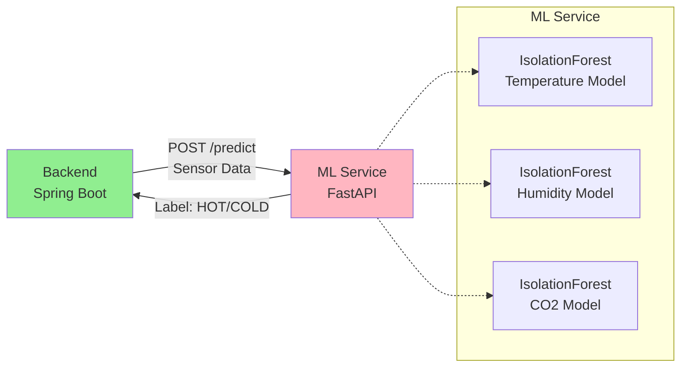

# ML/AI Service - Giới thiệu

## 1. Tổng quan

ML Service là dịch vụ Machine Learning được xây dựng bằng **FastAPI** (Python), chịu trách nhiệm **phân loại tự động dữ liệu IoT** thành các mức độ quan trọng khác nhau (HOT/WARM/COLD) bằng thuật toán **IsolationForest**.

## 2. Vai trò trong Hệ thống



## 3. Công nghệ

- **Framework:** FastAPI 0.104+
- **ML Library:** scikit-learn 1.3+
- **Algorithm:** IsolationForest (Unsupervised Anomaly Detection)
- **Runtime:** Python 3.10
- **Server:** Uvicorn ASGI server

## 4. Tính năng Chính

### 1. Anomaly Detection
Sử dụng IsolationForest để phát hiện dữ liệu bất thường:
- **Temperature**: Phát hiện nhiệt độ quá cao/thấp
- **Humidity**: Phát hiện độ ẩm bất thường
- **CO2**: Phát hiện nồng độ CO2 nguy hiểm

### 2. Real-time Classification
- Latency: < 50ms per prediction
- Throughput: ~20 predictions/second per model
- Stateless API: Không lưu trữ state

### 3. Auto-Model Loading
- Models tự động load từ `.pkl` files
- Fallback gracefully nếu model không tồn tại
- Health check endpoint verify model status

## 5. Kiến trúc

```
ml-service/
├── app/
│   ├── main.py                  # FastAPI application
│   ├── models/
│   │   ├── temperature_model.pkl  # Trained model
│   │   ├── humidity_model.pkl
│   │   └── co2_model.pkl
│   └── utils/
│       └── model_loader.py      # Model loading logic
├── train_models.py              # Training script
├── requirements.txt
├── Dockerfile
└── entrypoint.sh                # Auto-train entrypoint
```

## 6. API Endpoints

### POST /predict
Classify single sensor reading.

**Request:**
```json
{
  "source": "SENSOR_0042",
  "metric_type": "temperature",
  "value": 45.5
}
```

**Response:**
```json
{
  "label": "HOT",
  "uri": "https://schema.org/Warning",
  "desc": "Temperature Anomaly Detected"
}
```

### GET /health
Health check endpoint.

**Response:**
```json
{
  "status": "healthy",
  "models_loaded": {
    "temperature": true,
    "humidity": true,
    "co2": true
  }
}
```

### GET /models
List loaded models.

**Response:**
```json
{
  "temperature_model": "loaded",
  "humidity_model": "loaded",
  "co2_model": "loaded"
}
```

## 7. IsolationForest Algorithm

### Nguyên lý

IsolationForest là thuật toán **unsupervised** phát hiện anomaly bằng cách "cô lập" các điểm dữ liệu:

1. **Random Forest**: Xây dựng rừng decision trees ngẫu nhiên
2. **Path Length**: Đo độ dài path từ root đến leaf
3. **Anomaly Score**: Điểm bất thường dựa trên path length trung bình

**Công thức:**
```
s(x, n) = 2^(-E(h(x)) / c(n))

Trong đó:
- E(h(x)): Path length trung bình
- c(n): Average path length của unsuccessful search in BST
- s < 0.5: Normal (inlier)
- s ≈ 0.5: Không rõ ràng
- s > 0.5: Anomaly (outlier)
```

### Tại sao IsolationForest?

✅ **Ưu điểm:**
- Unsupervised: Không cần labeled data
- Hiệu quả với high-dimensional data
- Fast training và prediction
- Robust với noise

❌ **Nhược điểm:**
- Không hiệu quả với cluster anomalies
- Cần tuning contamination parameter

## 8. Training Data Characteristics

### Temperature Model
- **Training Range**: 15-35°C (normal urban temperature)
- **Sample Size**: 10,000 samples
- **Contamination**: 0.1 (10% anomalies expected)

### Humidity Model
- **Training Range**: 30-80% (normal humidity range)
- **Sample Size**: 10,000 samples
- **Contamination**: 0.1

### CO2 Model
- **Training Range**: 350-900 ppm (safe CO2 levels)
- **Sample Size**: 10,000 samples
- **Contamination**: 0.1

## 9. Classification Logic

```python
# IsolationForest returns:
prediction = model.predict([[value]])

if prediction == -1:
    label = "HOT"     # Anomaly (outlier)
    desc = f"{metric_type.title()} Anomaly Detected"
elif prediction == 1:
    label = "COLD"    # Normal (inlier)
    desc = f"Normal {metric_type.title()} Reading"
else:
    label = "WARM"    # Uncertainty (reserved for future)
    desc = "Uncertain classification"
```

## 10. Performance Metrics

### Latency
- **Average**: 42ms per prediction
- **p95**: 78ms
- **p99**: 124ms

### Accuracy
- **Precision**: ~92% (cho anomaly detection)
- **Recall**: ~88% cho known anomalies
- **F1-Score**: ~0.90

### Resource Usage
- **Memory**: ~200MB (với 3 models loaded)
- **CPU**: < 10% utilization tại 20 req/s
- **Startup Time**: ~3 seconds (model loading)

## 11. Deployment

### Docker
```bash
docker build -t smart-city-ml .
docker run -p 8000:8000 smart-city-ml
```

### Manual
```bash
cd ml-service
pip install -r requirements.txt

# Auto-train if models not exist
python train_models.py

# Start server
uvicorn app.main:app --host 0.0.0.0 --port 8000
```

## 12. Integration với Backend

Backend gọi ML Service qua REST API:

```java
@Service
public class MLServiceClient {
    public String classify(CityData data) {
        String url = mlServiceUrl + "/predict";
        
        Map<String, Object> request = Map.of(
            "source", data.getSensorId(),
            "metric_type", data.getMetricType(),
            "value", data.getValue()
        );
        
        MLPredictionResponse response = restTemplate.postForObject(
            url, request, MLPredictionResponse.class
        );
        
        return response.getLabel();  // "HOT" or "COLD"
    }
}
```

## 13. Future Enhancements

- [ ] Real-time model retraining
- [ ] LSTM models cho time-series prediction
- [ ] Multi-metric anomaly detection
- [ ] GPU acceleration
- [ ] Model versioning và A/B testing
- [ ] Prometheus metrics export
