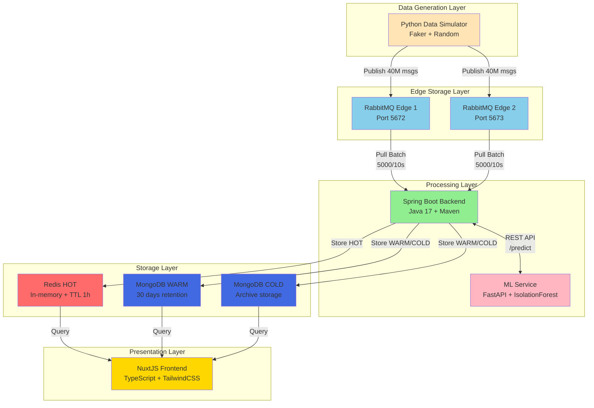
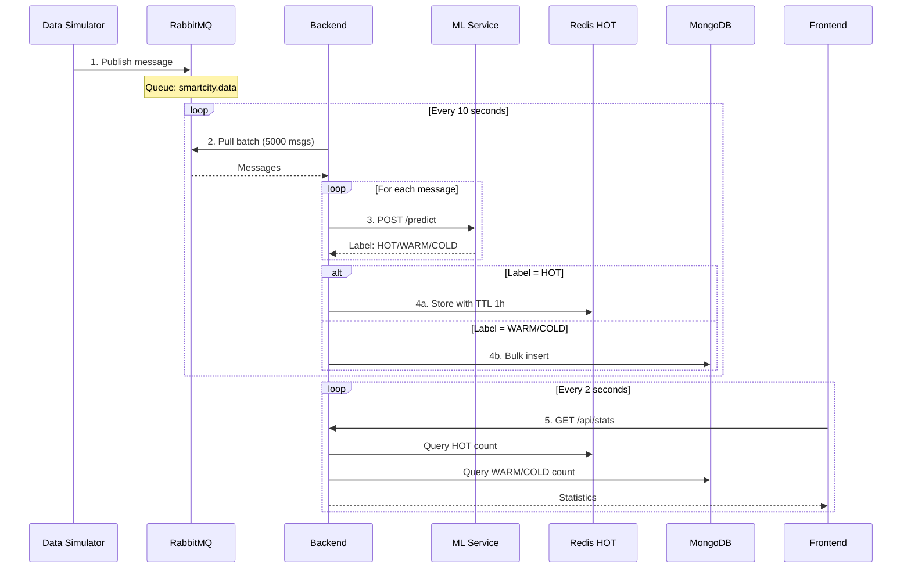
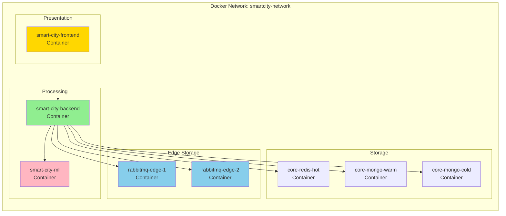

# 3. Kiến trúc Hệ thống (System Architecture)

## 3.1 Tổng quan Kiến trúc (Architecture Overview)

SmartCity-Platform áp dụng **kiến trúc microservices** với **pull-based data ingestion** và **tiered storage strategy**.

### Sơ đồ Kiến trúc Tổng thể



## 3.2 Component Architecture (Kiến trúc Component)

### 3.2.1 Data Simulator
**Công nghệ:** Python 3.10, Faker, pika (RabbitMQ client)

**Trách nhiệm:**
- Generate 40 triệu fake IoT messages
- Publish messages vào RabbitMQ queue `smartcity.data`
- Simulate 1000 sensors với metric: temperature, humidity, CO2

**Đặc điểm:**
- Multi-threaded: 20 concurrent threads
- Rate: ~500 messages/second
- Format: JSON với timestamp, sensorId, metricType, value

### 3.2.2 Edge Storage (RabbitMQ)
**Công nghệ:** RabbitMQ 3.x

**Trách nhiệm:**
- Buffer dữ liệu từ sensors
- Cung cấp queue cho backend pull
- Đảm bảo high availability với 2 nodes

**Topology:**
- **Exchange**: `smartcity.exchange` (type: direct)
- **Queue**: `smartcity.data`
- **Routing Key**: `sensor.data`

**Configuration:**
- Durable queue: true (persist to disk)
- Message TTL: None (giữ cho đến khi consumed)
- Prefetch count: 5000 (batch size)

### 3.2.3 Backend Service (Spring Boot)
**Công nghệ:** Spring Boot 3.2, Java 17, Maven

**Modules:**

**a) Data Ingestion Module**
- `RabbitMQIngestionService`: Pull messages từ RabbitMQ
- Scheduled task: Fixed rate 10 seconds
- Batch processing: 1000-5000 messages per batch

**b) ML Integration Module**
- `MLServiceClient`: REST client cho ML Service
- Endpoint: `POST http://ml-service:8000/predict`
- Retry logic: 3 attempts với exponential backoff

**c) Data Routing Module**
- `DataRoutingService`: Route data theo classification
- Logic: HOT → Redis, WARM/COLD → MongoDB
- Bulk operations cho MongoDB insert

**d) API Module**
- `DataController`: Endpoints cho data query
- `SystemController`: Endpoints cho system management
- CORS enabled cho frontend

**Ports:**
- 8080: REST API

### 3.2.4 ML Service (FastAPI)
**Công nghệ:** FastAPI, scikit-learn, uvicorn

**Models:**
- `temperature_model.pkl`: IsolationForest cho temperature anomaly
- `humidity_model.pkl`: IsolationForest cho humidity anomaly
- `co2_model.pkl`: IsolationForest cho CO2 anomaly

**API Endpoints:**
- `POST /predict`: Classify single message
- `GET /health`: Health check
- `GET /models`: List loaded models

**Classification Logic:**
```python
# IsolationForest returns:
# -1: Anomaly (outlier) → Label as HOT
# 1: Normal (inlier) → Label as COLD
```

**Performance:**
- Latency: < 50ms per prediction
- Throughput: ~20 requests/second per model

### 3.2.5 Storage Layer

**a) Redis (HOT Tier)**
- **Công nghệ:** Redis Alpine
- **Data Structure:** Hash với key pattern `hot:sensor:{sensorId}:{timestamp}`
- **TTL:** 3600 seconds (1 giờ)
- **Use Case:** Real-time dashboard queries

**b) MongoDB WARM**
- **Database:** `warm_db`
- **Collection:** `city_data`
- **Indexes:** 
  - `timestamp` (TTL index, 30 days)
  - `sensorId` (for query optimization)
  - `metricType` (for filtering)
- **Use Case:** Recent data analysis, trending

**c) MongoDB COLD**
- **Database:** `cold_db`
- **Collection:** `city_data`
- **Indexes:** Same as WARM
- **Retention:** Vĩnh viễn (no TTL)
- **Use Case:** Historical analysis, long-term storage

### 3.2.6 Frontend (NuxtJS)
**Công nghệ:** Nuxt 3, TypeScript, TailwindCSS, Pinia, ECharts

**Pages:**
- `/`: Dashboard với real-time charts
- `/data-explorer`: Data table với pagination
- `/system-control`: Manual sync và reset

**Components:**
- `RealtimeLineChart`: ECharts line chart
- `StatCard`: Storage statistics display
- `NodeCard`: Edge node status display

**State Management:**
- `systemStore`: System stats, edge nodes
- `dataStore`: City data, filters, pagination

## 3.3 Data Flow Architecture (Kiến trúc Luồng Dữ liệu)

### 3.3.1 End-to-End Data Flow



### 3.3.2 Message Format

**Input Message (from Simulator):**
```json
{
  "timestamp": "2025-12-04T22:57:00Z",
  "sensorId": "SENSOR_0042",
  "metricType": "temperature",
  "value": 45.5,
  "location": {
    "lat": 21.0285,
    "lng": 105.8542
  }
}
```

**ML Prediction Request:**
```json
{
  "source": "SENSOR_0042",
  "metric_type": "temperature",
  "value": 45.5
}
```

**ML Prediction Response:**
```json
{
  "label": "HOT",
  "uri": "https://schema.org/Warning",
  "desc": "Temperature Anomaly Detected"
}
```

**Stored Entity (CityData):**
```json
{
  "_id": "ObjectId(...)",
  "timestamp": "2025-12-04T22:57:00Z",
  "sensorId": "SENSOR_0042",
  "metricType": "temperature",
  "value": 45.5,
  "dataType": "HOT",
  "location": {
    "lat": 21.0285,
    "lng": 105.8542
  },
  "createdAt": "2025-12-04T22:57:01Z"
}
```

## 3.4 Deployment Architecture (Kiến trúc Triển khai)

### 3.4.1 Docker Compose Topology



### 3.4.2 Container Dependencies

**Dependency Graph:**
```
smart-city-frontend
  └─ depends_on: smart-city-backend

smart-city-backend
  ├─ depends_on: rabbitmq-edge-1
  ├─ depends_on: rabbitmq-edge-2
  ├─ depends_on: core-redis-hot
  ├─ depends_on: core-mongo-warm
  ├─ depends_on: core-mongo-cold
  └─ depends_on: smart-city-ml

smart-city-ml
  └─ (no dependencies)
```

### 3.4.3 Volume Mounts

```yaml
Volumes:
  - rabbitmq_edge1_data → /var/lib/rabbitmq
  - rabbitmq_edge2_data → /var/lib/rabbitmq
  - redis_hot_data → /data
  - mongo_warm_data → /data/db
  - mongo_cold_data → /data/db
```

## 3.5 Security Architecture (Kiến trúc Bảo mật)

### 3.5.1 Network Security
- **Container Isolation**: Tất cả services trong Docker network riêng
- **Port Exposure**: Chỉ expose ports cần thiết (3000, 8080, 8000, etc.)
- **No External Auth**: Demo system, không có authentication (future enhancement)

### 3.5.2 Data Security
- **No Encryption**: Dữ liệu không mã hóa (demo purpose)
- **Input Validation**: Backend validate input data format
- **SQL Injection Protection**: Sử dụng MongoDB (NoSQL)

### 3.5.3 Future Security Enhancements
- [ ] JWT-based authentication cho API
- [ ] HTTPS/TLS cho all communication
- [ ] RabbitMQ user authentication
- [ ] MongoDB role-based access control
- [ ] Rate limiting cho API endpoints

## 3.6 Scalability Architecture (Kiến trúc Khả năng Mở rộng)

### 3.6.1 Horizontal Scaling Points

**RabbitMQ:**
- Thêm edge nodes: `rabbitmq-edge-3`, `rabbitmq-edge-4`
- Backend tự động discover qua DNS

**Backend:**
- Run multiple instances với load balancer
- Mỗi instance pull từ RabbitMQ độc lập

**MongoDB:**
- Sharding cho WARM và COLD collections
- Replica sets cho high availability

**Frontend:**
- Nginx load balancer cho multiple frontend instances

### 3.6.2 Vertical Scaling Points

**Backend:**
- Increase batch size: `1000 → 10000`
- Increase thread pool: `10 → 50`
- Increase JVM heap: `-Xmx2g → -Xmx8g`

**ML Service:**
- Multiple worker processes với Gunicorn
- GPU acceleration cho predictions (future)

**Redis:**
- Increase max memory: `256mb → 2gb`
- Enable Redis Cluster mode

## 3.7 Performance Architecture (Tối ưu Hiệu năng)

### Optimization Strategies

**1. Batch Processing**
- Pull 5000 messages từ RabbitMQ mỗi lần
- Bulk insert vào MongoDB (1000 docs per batch)

**2. Parallel Processing**
- Multi-threaded message processing
- Concurrent ML predictions

**3. Caching**
- Redis cho HOT data (in-memory access)
- Application-level cache cho system stats

**4. Database Indexing**
- MongoDB indexes trên timestamp, sensorId
- Compound indexes cho complex queries

**5. Connection Pooling**
- RabbitMQ connection pool
- MongoDB connection pool
- Redis connection pool

## 3.8 Monitoring Architecture (Kiến trúc Giám sát)

### Current Monitoring

**Backend Metrics:**
- Data ingestion rate (incoming vs processed)
- Classification distribution (HOT/WARM/COLD counts)
- Edge node health status

**Frontend Dashboard:**
- Real-time charts (ECharts)
- Auto-refresh every 2 seconds
- Node status indicators

### Future Monitoring (Potential)

**Prometheus + Grafana:**
- JVM metrics (heap, CPU, threads)
- MongoDB performance metrics
- RabbitMQ queue depth
- Custom business metrics

**Logging Stack:**
- ELK (Elasticsearch, Logstash, Kibana)
- Centralized log aggregation
- Log retention policies
