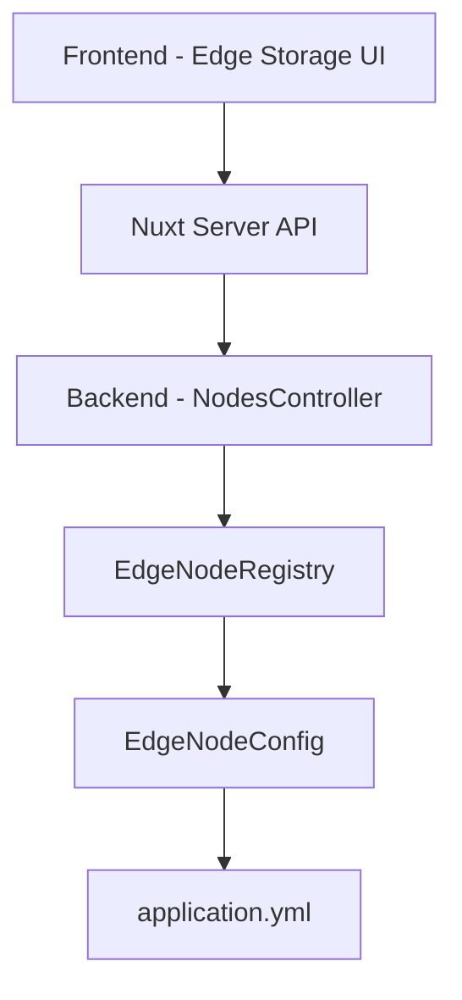

# Edge Storage Management

## Tổng Quan

Edge Storage Management là module quản lý các Edge Storage nodes trong hệ thống SmartCity Platform. Module này cho phép quản trị viên theo dõi, cấu hình và quản lý các RabbitMQ edge nodes phân tán theo khu vực địa lý.

## Mục Đích

Cung cấp giao diện quản lý tập trung cho:
- Giám sát trạng thái các edge storage nodes
- Thêm/xóa edge nodes động
- Bật/tắt các edge nodes
- Xem thông tin cấu hình chi tiết

## Kiến Trúc

### Components



### Data Flow

1. **Frontend** gửi request đến Nuxt Server API routes
2. **Server API** proxy request đến Backend REST API
3. **NodesController** xử lý business logic
4. **EdgeNodeRegistry** quản lý in-memory list của edge nodes
5. **EdgeNodeConfig** load configuration từ `application.yml`

## Functional Requirements

### FR-ESM-01: Xem Danh Sách Edge Nodes

**Priority:** High  
**Status:** Implemented ✅

**Description:**  
Hệ thống phải hiển thị danh sách tất cả edge storage nodes với thông tin chi tiết.

**Acceptance Criteria:**
- ✅ Hiển thị table với các cột: Name, Host, Port, Status, Enabled, Actions
- ✅ Status badge với màu sắc phân biệt (green=online, gray=offline)
- ✅ Toggle switch hiển thị trạng thái enabled/disabled
- ✅ Tự động refresh danh sách khi có thay đổi
- ✅ Loading state khi fetch data

**API Endpoint:** `GET /api/nodes`

---

### FR-ESM-02: Thêm Edge Node Mới

**Priority:** High  
**Status:** Implemented ✅

**Description:**  
Quản trị viên có thể thêm edge node mới vào hệ thống thông qua form dialog.

**Acceptance Criteria:**
- ✅ Form dialog với các fields: name, host, port, queueName, username, password
- ✅ Validation: name và host là required
- ✅ Port mặc định là 5672
- ✅ queueName, username, password là optional
- ✅ Hiển thị error message nếu node name đã tồn tại
- ✅ Tự động refresh list sau khi thêm thành công

**API Endpoint:** `POST /api/nodes`

**Request Body:**
```json
{
  "name": "Subnet-HaDong",
  "host": "rabbit-edge-3",
  "port": 5672,
  "queueName": "city-data-queue-3",
  "username": "edge_user",
  "password": "edge_pass"
}
```

---

### FR-ESM-03: Toggle Enable/Disable Node

**Priority:** High  
**Status:** Implemented ✅

**Description:**  
Quản trị viên có thể bật/tắt edge node mà không cần xóa.

**Acceptance Criteria:**
- ✅ Toggle switch interactive tại cột "Enabled"
- ✅ Click toggle gọi API để đổi trạng thái
- ✅ Visual feedback (switch animation)
- ✅ Status badge tự động cập nhật
- ✅ Không reload toàn bộ trang

**API Endpoint:** `PUT /api/nodes/{name}/toggle`

**Behavior:**
- Node enabled → data ingestion active
- Node disabled → data ingestion paused

---

### FR-ESM-04: Xóa Edge Node

**Priority:** Medium  
**Status:** Implemented ✅

**Description:**  
Quản trị viên có thể xóa edge node khỏi hệ thống.

**Acceptance Criteria:**
- ✅ Delete button (trash icon) tại cột Actions
- ✅ Confirmation dialog trước khi xóa
- ✅ Hiển thị tên node trong confirmation message
- ✅ Error handling nếu node không tồn tại
- ✅ Tự động refresh list sau khi xóa thành công

**API Endpoint:** `DELETE /api/nodes/{name}`

**Confirmation Dialog:**
```
Are you sure you want to delete Subnet-CauGiay?
This action cannot be undone.
```

---

### FR-ESM-05: Navigation Integration

**Priority:** High  
**Status:** Implemented ✅

**Description:**  
Edge Storage Management phải được tích hợp vào main navigation menu.

**Acceptance Criteria:**
- ✅ Menu item "Edge Storage" trong sidebar
- ✅ Icon: HardDrive (lucide-vue-next)
- ✅ Active state khi đang ở trang `/nodes`
- ✅ Page title hiển thị "Edge Storage Management" trong header
- ✅ Ngang hàng với Dashboard, Data Explorer, System Control

**Route:** `/nodes`

---

## Non-Functional Requirements

### NFR-ESM-01: Performance

- Danh sách edge nodes phải load trong < 500ms
- Toggle operation phải responsive < 200ms
- Add/Delete operations phải complete trong < 1s

### NFR-ESM-02: Usability

- UI phải responsive trên desktop và tablet
- Form validation phải real-time
- Error messages phải rõ ràng và actionable
- Confirmation dialogs cho destructive actions

### NFR-ESM-03: Reliability

- Graceful error handling khi backend unavailable
- Retry logic cho failed API calls
- Optimistic UI updates với rollback on error

### NFR-ESM-04: Security

- Chỉ authenticated users mới access được
- Password field trong form phải hidden (type="password")
- CORS protection cho API endpoints

---

## Data Model

### EdgeNode

```typescript
interface EdgeNode {
  id: string;           // Unique identifier (lowercase, hyphenated)
  name: string;         // Display name (e.g., "Subnet-CauGiay")
  host: string;         // RabbitMQ hostname
  port: number;         // RabbitMQ port (default: 5672)
  enabled: boolean;     // Enabled/disabled state
  status: string;       // Connection status: "online" | "offline"
  lastPing?: string;    // Last ping timestamp (ISO 8601)
}
```

### Backend Configuration (application.yml)

```yaml
app:
  edge:
    nodes:
      - name: "Subnet-CauGiay"
        host: "rabbit-edge-1"
        port: 5672
        queue-name: "city-data-queue-1"
        username: "edge_user"
        password: "edge_pass"
        enabled: true
```

---

## User Stories

### US-ESM-01: Monitor Edge Nodes

**As a** system administrator  
**I want to** view all edge storage nodes and their status  
**So that** I can monitor the health of the distributed storage system

**Acceptance:**
- Can see list of all nodes
- Status clearly visible (online/offline)
- Can identify which nodes are enabled/disabled

### US-ESM-02: Add New Region

**As a** system administrator  
**I want to** add a new edge node for a new city region  
**So that** we can expand coverage to new areas

**Acceptance:**
- Can add node through UI form
- Validation prevents duplicate names
- New node immediately available for data ingestion

### US-ESM-03: Temporary Disable Node

**As a** system administrator  
**I want to** temporarily disable an edge node without deleting it  
**So that** I can perform maintenance or troubleshooting

**Acceptance:**
- Can toggle node on/off with one click
- Disabled node stops receiving data
- Can re-enable easily

### US-ESM-04: Remove Obsolete Node

**As a** system administrator  
**I want to** delete edge nodes that are no longer needed  
**So that** the system stays clean and manageable

**Acceptance:**
- Confirmation required before deletion
- Deleted node removed from all systems
- Cannot accidentally delete in-use nodes

---

## Technical Implementation

### Frontend Components

**Location:** `frontend/pages/nodes.vue`

**Features:**
- Data table with sortable columns
- Add node modal dialog
- Delete confirmation dialog
- Toggle switches
- Loading states
- Error handling

### Backend Components

**Location:** `backend/src/main/java/com/smartcity/controller/NodesController.java`

**Endpoints:**
- `GET /api/nodes` - List all nodes
- `POST /api/nodes` - Create node
- `PUT /api/nodes/{name}/toggle` - Toggle status
- `DELETE /api/nodes/{name}` - Delete node

**Service:** `EdgeNodeRegistry.java`
- In-memory node management
- Configuration loading from `application.yml`
- Thread-safe CRUD operations

### Nuxt Server API

**Location:** `frontend/server/api/nodes/`

**Routes:**
- `index.get.ts` - Proxy GET requests
- `index.post.ts` - Proxy POST requests
- `[name]/toggle.put.ts` - Proxy toggle requests
- `[name]/index.delete.ts` - Proxy delete requests

**Purpose:** Backend URL configuration and CORS handling

---

## Testing

### Unit Tests

- [❌] EdgeNodeRegistry CRUD operations
- [❌] NodesController endpoint logic
- [❌] Form validation in frontend

### Integration Tests

- [✅] Manual API testing with curl
- [✅] End-to-end UI testing via browser
- [❌] Automated E2E tests

### Manual Test Cases

**TC-01: View Nodes List**
1. Navigate to `/nodes`
2. Verify 2 default nodes displayed
3. Verify status badges show "Online"
4. Verify toggle switches are ON

✅ **PASS**

**TC-02: Add New Node**
1. Click "Add Node" button
2. Fill form: name="Test-Node", host="rabbit-test", port=5672
3. Click "Add Node"
4. Verify node appears in list
5. Verify node is enabled by default

✅ **PASS**

**TC-03: Toggle Node**
1. Click toggle switch for a node
2. Verify switch changes to OFF position
3. Verify status badge changes to "Offline"
4. Click toggle again
5. Verify switch returns to ON
6. Verify status badge returns to "Online"

✅ **PASS**

**TC-04: Delete Node**
1. Click delete (trash) icon
2. Verify confirmation dialog appears
3. Click "Cancel" → dialog closes, node remains
4. Click delete again
5. Click "Delete" → node removed from list

✅ **PASS**

---

## Future Enhancements

### Phase 2

- [ ] Real-time status monitoring với WebSocket
- [ ] Health check endpoint cho từng node
- [ ] Performance metrics (throughput, latency)
- [ ] Auto-discovery của new nodes
- [ ] Node grouping by region/zone

### Phase 3

- [ ] Load balancing configuration
- [ ] Failover strategy settings
- [ ] Backup/restore node configurations
- [ ] Audit log cho node management actions
- [ ] Role-based access control

---

## References

- [Backend API Reference](./backend-docs/api-reference.md#edge-storage-management-endpoints)
- [Frontend Documentation](./frontend-docs/intro.md)
- [System Architecture](./overview-docs/architecture.md)
