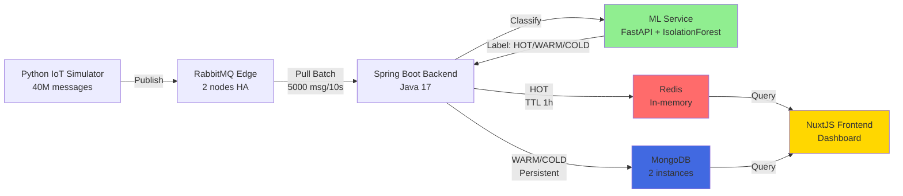

# 1. Giới thiệu

## 1.1 Mục đích Tài liệu (Purpose)

Tài liệu này mô tả **Software Requirements Specification (SRS)** cho hệ thống **SmartCity-Platform** - một nền tảng dữ liệu đô thị thông minh dành cho cuộc thi Phần Mềm Nguồn Mở 2025.

**Đối tượng sử dụng tài liệu:**
- **Developers**: Hiểu rõ kiến trúc, API, và quy trình phát triển
- **System Administrators**: Triển khai, cấu hình và vận hành hệ thống
- **Project Managers**: Quản lý dự án, đánh giá tiến độ
- **End Users**: Hiểu các tính năng và cách sử dụng platform

## 1.2 Phạm vi Dự án (Scope)

**SmartCity-Platform** là một nền tảng thu thập, xử lý và lưu trữ dữ liệu IoT quy mô lớn với các đặc điểm chính:

**Tên sản phẩm:** SmartCity-Platform v1.0

**Mục tiêu:**
- **Thu thập dữ liệu**: Xử lý hàng triệu message từ cảm biến IoT (temperature, humidity, CO2)
- **Phân loại thông minh**: Sử dụng Machine Learning (IsolationForest) để tự động phân loại dữ liệu theo mức độ quan trọng
- **Lưu trữ phân tầng**: Áp dụng kiến trúc Tiered Storage (HOT/WARM/COLD) để tối ưu hiệu năng và chi phí
- **Giám sát real-time**: Dashboard trực quan để theo dõi trạng thái hệ thống

**Lợi ích:**
- ✅ Tính sẵn sàng cao (High Availability) - không bao giờ sập do quá tải
- ✅ Xử lý ưu tiên thông minh - dữ liệu khẩn cấp được xử lý ngay lập tức
- ✅ Khả năng mở rộng - hỗ trợ đến 40 triệu messages
- ✅ Tiết kiệm tài nguyên - dữ liệu thường được lưu trữ hiệu quả

**Ranh giới:**
- ✅ **Trong phạm vi**: Data ingestion, ML classification, tiered storage, monitoring dashboard
- ❌ **Ngoài phạm vi**: IoT device management, user authentication/authorization, advanced analytics/reporting

## 1.3 Định nghĩa, Từ viết tắt và Ký hiệu (Definitions, Acronyms, and Abbreviations)

| Thuật ngữ | Định nghĩa |
|-----------|-----------|
| **IoT** | Internet of Things - Mạng lưới các thiết bị vật lý có khả năng kết nối internet |
| **ML** | Machine Learning - Học máy |
| **SRS** | Software Requirements Specification - Đặc tả yêu cầu phần mềm |
| **API** | Application Programming Interface - Giao diện lập trình ứng dụng |
| **REST** | Representational State Transfer - Kiến trúc API |
| **TTL** | Time To Live - Thời gian tồn tại của dữ liệu |

### Tiered Storage Classification

| Tier | Mô tả | Storage | TTL | Use Case |
|------|-------|---------|-----|----------|
| **HOT** | Dữ liệu bất thường/khẩn cấp | Redis (In-memory) | 1 giờ | Cảnh báo real-time, dashboard |
| **WARM** | Dữ liệu quan trọng gần đây | MongoDB | 30 ngày | Phân tích xu hướng |
| **COLD** | Dữ liệu thông thường | MongoDB Archive | Vĩnh viễn | Lưu trữ lịch sử, báo cáo |

### ML Models

| Model | Mục đích | Algorithm | Input |
|-------|----------|-----------|-------|
| **Temperature Model** | Phát hiện nhiệt độ bất thường | IsolationForest | Temperature (°C) |
| **Humidity Model** | Phát hiện độ ẩm bất thường | IsolationForest | Humidity (%) |
| **CO2 Model** | Phát hiện CO2 nguy hiểm | IsolationForest | CO2 (ppm) |

## 1.4 Tài liệu Tham khảo (References)

1. **IEEE Std 830-1998** - IEEE Recommended Practice for Software Requirements Specifications
2. **Spring Boot Documentation** - https://spring.io/projects/spring-boot
3. **FastAPI Documentation** - https://fastapi.tiangolo.com/
4. **Nuxt 3 Documentation** - https://nuxt.com/
5. **scikit-learn Documentation** - https://scikit-learn.org/
6. **Docker Documentation** - https://docs.docker.com/
7. **RabbitMQ Documentation** - https://www.rabbitmq.com/documentation.html
8. **MongoDB Documentation** - https://docs.mongodb.com/
9. **Redis Documentation** - https://redis.io/documentation

## 1.5 Tổng quan Tài liệu

Tài liệu này được tổ chức thành các phần sau:

1. **Overview** (Bạn đang đọc) - Giới thiệu chung, mục đích, phạm vi
2. **System Requirements** - Yêu cầu chức năng và phi chức năng chi tiết
3. **Backend Documentation** - Kiến trúc backend, API reference, data models
4. **Frontend Documentation** - Giao diện người dùng, components, state management
5. **ML/AI Documentation** - Mô hình ML, training process, classification logic
6. **Infrastructure** - Docker setup, deployment, troubleshooting

---

## 2. Vấn đề Đặt ra (Problem Statement)

Trong một Thành phố Thông minh, dữ liệu được thu thập từ vô số nguồn (cảm biến, camera AI, thiết bị IoT). Tuy nhiên, các kiến trúc truyền thống thường gặp các vấn đề nghiêm trọng:

### 2.1 Quá tải Hệ thống
Khi xảy ra sự kiện lớn (kẹt xe, ô nhiễm, thiên tai), hàng triệu thiết bị đồng loạt PUSH dữ liệu về máy chủ trung tâm, gây nghẽn và sập toàn bộ hệ thống.

**Hậu quả:** Mất khả năng giám sát đúng lúc cần nhất

### 2.2 Mất Dữ liệu
Khi hệ thống sập, toàn bộ dữ liệu quan trọng đang gửi đến sẽ bị mất, không thể phục hồi.

**Hậu quả:** Thiếu dữ liệu lịch sử cho phân tích

### 2.3 Không có Ưu tiên
Dữ liệu cảnh báo khẩn cấp (ví dụ: Cháy, CO2 cao) bị xử lý lẫn lộn và chậm trễ ngang với dữ liệu thống kê thông thường.

**Hậu quả:** Phản ứng chậm với tình huống nguy hiểm

## 3. Giải pháp (Solution Overview)

SmartCity-Platform giải quyết triệt để các vấn đề trên bằng kiến trúc **Pull-based Tiered Storage** với ML Classification.

### 3.1 Kiến trúc Tổng quan

### 3.2 Nguyên lý Hoạt động

**Bước 1: Edge Buffering**
- IoT simulator gửi 40 triệu messages vào RabbitMQ
- 2 RabbitMQ nodes (HA configuration) làm edge buffer
- Chịu tải cao, không bao giờ từ chối dữ liệu

**Bước 2: Pull-based Ingestion**
- Backend chủ động PULL theo batch (5000 messages/10 giây)
- Kiểm soát 100% tốc độ xử lý
- Tránh quá tải hệ thống lõi

**Bước 3: ML Classification**
- Mỗi message được gửi đến ML Service
- IsolationForest models phân loại: HOT (anomaly) / WARM / COLD (normal)
- Latency < 50ms per message

**Bước 4: Tiered Storage**
- **HOT** → Redis (1 giờ TTL, real-time access)
- **WARM/COLD** → MongoDB (persistent, historical analysis)

**Bước 5: Visualization**
- Frontend NuxtJS poll data mỗi 2 giây
- Real-time charts, statistics, node status

## 4. Nguyên tắc Cốt lõi (Core Principles)

### 4.1 High Availability (Tính Sẵn sàng Cao)
Mô hình Pull + Buffer đảm bảo hệ thống không bao giờ sập do quá tải đầu vào. Backend có thể điều chỉnh tốc độ pull theo khả năng xử lý.

### 4.2 Intelligent Prioritization (Ưu tiên Thông minh)
ML-based classification đảm bảo dữ liệu quan trọng (HOT) được lưu trữ với độ ưu tiên cao nhất và truy cập nhanh nhất.

### 4.3 Scalability (Khả năng Mở rộng)
- Horizontal scaling: Thêm RabbitMQ nodes, MongoDB shards
- Vertical scaling: Tăng batch size, thread pool

### 4.4 Resilience (Khả năng Phục hồi)
- RabbitMQ 2-node HA: Nếu 1 node fail, hệ thống vẫn hoạt động
- MongoDB replica set: Dữ liệu được backup tự động
- Redis persistence: Snapshot định kỳ

## 5. Tầm nhìn (Vision)

SmartCity-Platform được kỳ vọng trở thành **kiến trúc tham chiếu (reference architecture)** cho các hệ thống Smart City tại Việt Nam, chứng minh rằng có thể xây dựng một nền tảng:

- ✅ Tuân thủ các best practices quốc tế
- ✅ Hoạt động ổn định, tin cậy dưới tải cao
- ✅ Dễ triển khai với Docker
- ✅ Dễ mở rộng và bảo trì