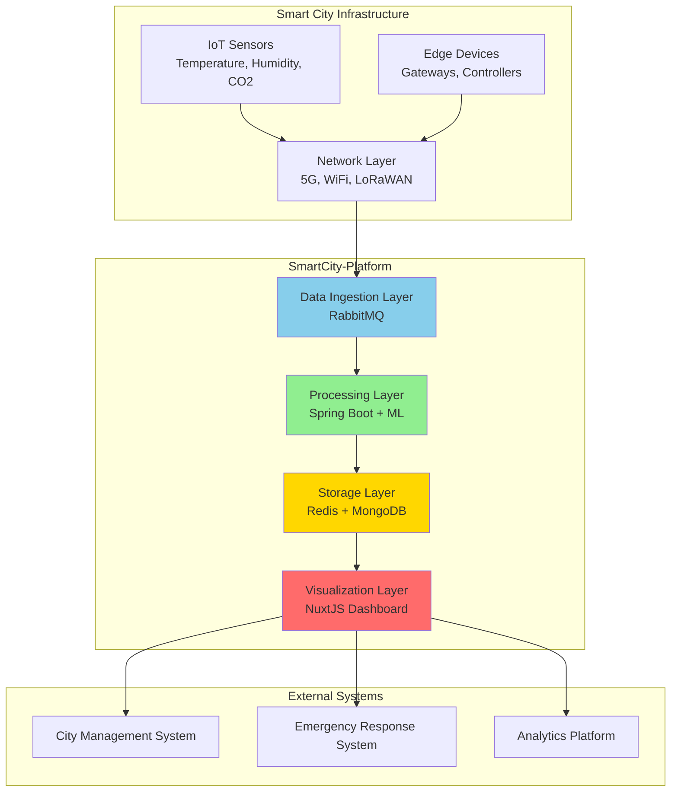
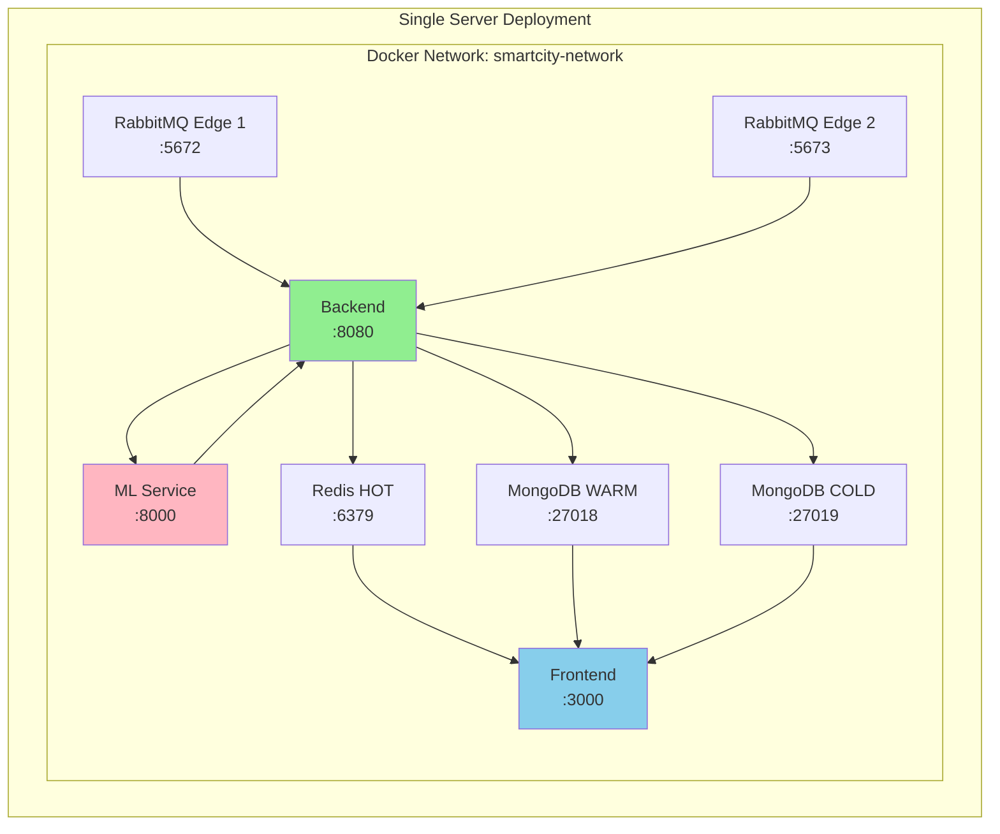

# 2. Mô tả Hệ thống (Overall Description)

## 2.1 Product Perspective (Vị trí Sản phẩm)

SmartCity-Platform là một **hệ thống độc lập** (standalone system) được thiết kế để hoạt động trong môi trường Smart City. Hệ thống này đóng vai trò là **trung tâm thu thập và xử lý dữ liệu IoT** (IoT Data Hub) cho toàn bộ cơ sở hạ tầng đô thị thông minh.

### Vị trí trong Smart City Ecosystem

### Giao diện Hệ thống (System Interfaces)

**1. Hardware Interfaces:**
- Không có giao diện phần cứng trực tiếp
- Nhận dữ liệu qua network từ IoT sensors

**2. Software Interfaces:**
- **RabbitMQ AMQP 0-9-1**: Message queue protocol
- **REST API**: HTTP/1.1 với JSON payload
- **MongoDB Wire Protocol**: Database communication
- **Redis Protocol (RESP)**: Cache communication

**3. Communication Interfaces:**
- **Port 5672-5673**: RabbitMQ AMQP
- **Port 15672-15673**: RabbitMQ Management UI
- **Port 8080**: Backend REST API
- **Port 8000**: ML Service API
- **Port 3000**: Frontend Dashboard
- **Port 6379**: Redis Cache
- **Port 27018-27019**: MongoDB Instances

## 2.2 Product Features (Tính năng Sản phẩm)

### PF-1: High-Performance Data Ingestion
**Mô tả:** Thu thập dữ liệu từ RabbitMQ với throughput cao

**Đặc điểm:**
- Batch processing: 5000 messages/lần
- Pull interval: 10 giây (có thể cấu hình)
- Multi-threaded: Xử lý song song từ nhiều edge nodes
- Throughput: ~500 messages/second

### PF-2: ML-Based Data Classification
**Mô tả:** Phân loại dữ liệu tự động bằng Machine Learning

**Đặc điểm:**
- 3 trained IsolationForest models (temperature, humidity, CO2)
- Latency classification: < 50ms per message
- Accuracy: Phát hiện anomaly với precision cao
- Auto-labeling: HOT/WARM/COLD

### PF-3: Tiered Storage Management
**Mô tả:** Quản lý dữ liệu trên 3 tầng lưu trữ

**Đặc điểm:**
- **HOT tier** (Redis): In-memory, TTL 1 giờ, cho real-time access
- **WARM tier** (MongoDB): Persistent, retention 30 ngày
- **COLD tier** (MongoDB): Archive, retention vĩnh viễn
- Automatic data routing dựa trên classification

### PF-4: Real-time Dashboard
**Mô tả:** Giao diện giám sát trực quan với cập nhật real-time

**Đặc điểm:**
- Auto-refresh mỗi 2 giây
- Real-time charts (ECharts)
- Node status monitoring
- Storage statistics

### PF-5: RESTful API
**Mô tả:** API endpoints cho query và quản lý hệ thống

**Đặc điểm:**
- `/api/stats`: System statistics
- `/api/data`: Paginated data query
- `/api/nodes`: Edge node status
- `/api/sync/trigger`: Manual sync

### PF-6: Edge Node Discovery
**Mô tả:** Tự động phát hiện và kết nối RabbitMQ edge nodes

**Đặc điểm:**
- DNS-based discovery
- Health check mỗi 30 giây
- Auto-reconnect khi node failed
- Support multiple nodes

### PF-7: System Scalability
**Mô tả:** Khả năng mở rộng horizontal và vertical

**Đặc điểm:**
- Horizontal: Thêm RabbitMQ nodes, MongoDB shards
- Vertical: Tăng batch size, thread pool size
- Tested: 40 million messages

### PF-8: Containerized Deployment
**Mô tả:** Triển khai đầy đủ bằng Docker Compose

**Đặc điểm:**
- One-command deployment: `docker-compose up -d`
- All services containerized
- Network isolation
- Volume persistence

## 2.3 User Characteristics (Đặc điểm Người dùng)

### UC-1: System Administrator
**Vai trò:** Triển khai và vận hành hệ thống

**Đặc điểm:**
- Kinh nghiệm: Docker, Linux system administration
- Kỹ năng kỹ thuật: Cao
- Tương tác: Docker CLI, RabbitMQ Management, MongoDB shell

**Nhu cầu:**
- Deployment guide
- Troubleshooting documentation
- Configuration reference

### UC-2: Application Developer
**Vai trò:** Tích hợp SmartCity-Platform vào ứng dụng bên thứ 3

**Đặc điểm:**
- Kinh nghiệm: REST API, JSON, HTTP
- Kỹ năng kỹ thuật: Trung bình - Cao
- Tương tác: API endpoints

**Nhu cầu:**
- API reference documentation
- Code examples
- Error handling guide

### UC-3: Data Analyst
**Vai trò:** Phân tích dữ liệu IoT từ dashboard

**Đặc điểm:**
- Kinh nghiệm: Data analysis, basic IT
- Kỹ năng kỹ thuật: Trung bình
- Tương tác: Web dashboard

**Nhu cầu:**
- User-friendly dashboard
- Data export features
- Visualization tools

### UC-4: Project Manager
**Vai trò:** Giám sát dự án, đánh giá tiến độ

**Đặc điểm:**
- Kinh nghiệm: Project management, basic technical knowledge
- Kỹ năng kỹ thuật: Thấp - Trung bình
- Tương tác: Documentation, reports

**Nhu cầu:**
- System overview documentation
- Feature list
- Performance metrics

## 2.4 Constraints (Ràng buộc)

### C-1: Technology Stack
**Ràng buộc:** Phải sử dụng các công nghệ mã nguồn mở

**Lý do:** Yêu cầu của cuộc thi PMNM 2025

**Ảnh hưởng:** Giới hạn lựa chọn công nghệ

### C-2: Deployment Platform
**Ràng buộc:** Hệ thống phải chạy trên Docker

**Lý do:** Yêu cầu dễ triển khai và portable

**Ảnh hưởng:** Tất cả services phải containerized

### C-3: Programming Language
**Ràng buộc:** 
- Backend: Java 17 (Spring Boot)
- ML Service: Python 3.10+
- Frontend: TypeScript (Nuxt 3)

**Lý do:** Tận dụng ecosystem và tooling

**Ảnh hưởng:** Team cần kinh nghiệm với các ngôn ngữ này

### C-4: Database
**Ràng buộc:** Phải sử dụng NoSQL database

**Lý do:** Flexibility cho IoT data schema

**Ảnh hưởng:** Chọn MongoDB và Redis

### C-5: Performance
**Ràng buộc:** Phải xử lý được tối thiểu 40 triệu messages

**Lý do:** Demo requirement

**Ảnh hưởng:** Cần tối ưu batch processing và storage

### C-6: Budget
**Ràng buộc:** Zero cost deployment (self-hosted)

**Lý do:** Open source project

**Ảnh hưởng:** Không sử dụng cloud services trả phí

## 2.5 Assumptions and Dependencies (Giả định và Phụ thuộc)

### Assumptions (Giả định)

**A-1: Infrastructure Availability**
- Giả định có server/VM với ít nhất 8GB RAM
- Giả định có kết nối internet ổn định cho Docker pull images

**A-2: Data Format**
- Giả định dữ liệu IoT có format JSON chuẩn
- Giả định có 3 metric types: temperature, humidity, CO2

**A-3: User Access**
- Giả định người dùng có browser hiện đại (Chrome, Firefox, Edge)
- Giả định người dùng có quyền truy cập network tới các port

**A-4: Operating System**
- Giả định hệ thống chạy trên Linux hoặc Windows với Docker Desktop

### Dependencies (Phụ thuộc)

**D-1: Docker & Docker Compose**
- **Version**: Docker 20.x+, Docker Compose 2.x+
- **Criticality**: High - Toàn bộ hệ thống phụ thuộc
- **Mitigation**: Cung cấp hướng dẫn cài đặt

**D-2: RabbitMQ**
- **Version**: RabbitMQ 3.x
- **Criticality**: High - Edge storage layer
- **Mitigation**: Sử dụng official Docker image

**D-3: MongoDB**
- **Version**: MongoDB 7.0
- **Criticality**: High - Persistent storage
- **Mitigation**: Replica set cho high availability

**D-4: Redis**
- **Version**: Redis Alpine
- **Criticality**: Medium - HOT tier storage (có thể fallback)
- **Mitigation**: Persistence configuration

**D-5: Python Libraries**
- **scikit-learn**: ML models
- **FastAPI**: ML service framework
- **Criticality**: High - Classification không hoạt động nếu thiếu
- **Mitigation**: Dockerfile với dependencies fixed

**D-6: Java Runtime**
- **Version**: OpenJDK 17
- **Criticality**: High - Backend runtime
- **Mitigation**: Sử dụng base image có sẵn JDK

**D-7: Node.js Runtime**
- **Version**: Node.js 20.x
- **Criticality**: Medium - Frontend build/runtime
- **Mitigation**: Sử dụng official Node.js image

## 2.6 Operating Environment (Môi trường Vận hành)

### Hardware Requirements

**Minimum:**
- CPU: 2 cores
- RAM: 8 GB
- Disk: 20 GB SSD
- Network: 100 Mbps

**Recommended:**
- CPU: 4+ cores
- RAM: 16 GB
- Disk: 50 GB SSD
- Network: 1 Gbps

### Software Requirements

**Operating System:**
- Linux (Ubuntu 20.04+, CentOS 8+, Debian 11+)
- Windows 10/11 with WSL2
- macOS 11+ (not tested)

**Required Software:**
- Docker Engine 20.x+
- Docker Compose 2.x+
- Git (for source code)

**Network Ports:**
- 3000, 5672-5673, 6379, 8000, 8080, 8081, 15672-15673, 27018-27019 phải available

### Deployment Topology

### Browser Support

- Chrome 90+
- Firefox 88+
- Edge 90+
- Safari 14+ (limited testing)
